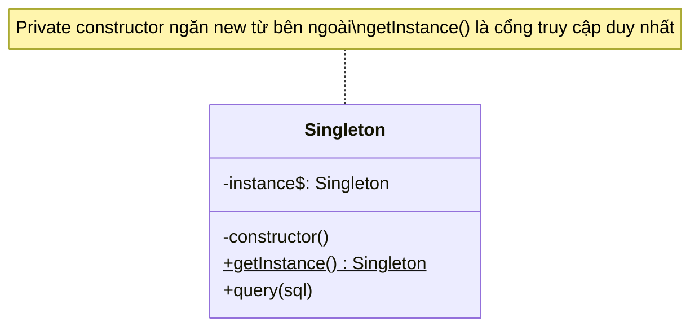

# Singleton Pattern (Mẫu Khởi Tạo Đơn Nhất)

**Singleton Pattern** là mẫu thiết kế thuộc nhóm **Creational (Khởi tạo)**. Nó đảm bảo rằng một Class chỉ có **duy nhất một thực thể (Instance)** được tạo ra trong suốt vòng đời của ứng dụng, và cung cấp một điểm truy cập chung cho toàn bộ ứng dụng.

---

## 1. Ví dụ thực tế cho dễ hiểu

### 🗽 Ví dụ: Tổng thống của một quốc gia
Mỗi quốc gia chỉ có thể có **duy nhất 1 vị Tổng thống** tại một thời điểm.
* Bạn không thể tự ý tạo ra một tổng thống mới bằng cách gọi lệnh `new TongThong()`. Nếu ai thích cũng tự tạo ra tổng thống riêng, đất nước sẽ loạn.
* Bất kỳ người dân hay bộ ngành nào muốn làm việc với tổng thống thì đều phải gặp **cùng một vị tổng thống duy nhất** đó thông qua văn phòng tổng thống (`TongThong.getInstance()`).

### 💻 Trong lập trình:
* **Database Connection Pool:** Kết nối tới Cơ sở dữ liệu. Chúng ta không muốn mỗi lần cần truy vấn lại mở một kết nối mới, vì nó sẽ nhanh chóng làm quá tải và sập Database Server.
* **Logger Service:** Ghi log hệ thống. Cần một file log duy nhất để ghi nhận sự kiện của toàn hệ thống một cách đồng bộ.
* **Application Configuration:** Đọc các biến cấu hình từ file `.env` (chỉ cần đọc một lần và lưu vào bộ nhớ dùng chung).

---

## 2. Vấn đề & Giải pháp

* **Vấn đề (Nếu không dùng Singleton):** 
  Cứ mỗi lần cần query, lập trình viên lại dùng từ khóa `new DatabaseConnection()`. Nếu có 10,000 requests cùng lúc => 10,000 kết nối được tạo ra => Server sập.
* **Giải pháp (Dùng Singleton):**
  Chỉ tạo đúng 1 kết nối duy nhất khi ứng dụng chạy. Toàn bộ mọi nơi trong ứng dụng sẽ dùng chung kết nối duy nhất đó.

---

## Sơ đồ cấu trúc



---

## 3. Công thức "3 Bước Vàng" để tạo Singleton

Để ngăn chặn việc tạo ra nhiều đối tượng từ bên ngoài, Singleton áp dụng công thức sau:

```typescript
class DatabaseConnection {
  // 1️⃣ BƯỚC 1: Tạo một biến static private để cất giữ thực thể duy nhất (bảo vật)
  private static instance: DatabaseConnection | null = null;
  private connectionId: number;

  // 2️⃣ BƯỚC 2: Private Constructor - KHÓA CỬA CHÍNH!
  // Đổi thành "private" để chặn tuyệt đối việc dùng từ khóa "new" từ bên ngoài Class.
  private constructor() {
    this.connectionId = Math.floor(Math.random() * 1000) + 1;
    console.log(`\n[DB CONNECTED] Thiết lập kết nối thành công! ID: ${this.connectionId}`);
  }

  // 3️⃣ BƯỚC 3: Tạo phương thức static public để làm "người gác cổng"
  public static getInstance(): DatabaseConnection {
    // Nếu chưa có ai kết nối (instance đang null) -> tạo mới 1 lần duy nhất
    if (!DatabaseConnection.instance) {
      DatabaseConnection.instance = new DatabaseConnection(); // Ở trong class nên gọi new thoải mái
    }
    // Nếu đã tạo rồi -> trả về ngay kết nối cũ đó
    return DatabaseConnection.instance;
  }

  // Phương thức nghiệp vụ thông thường
  public query(sql: string): void {
    console.log(`[QUERY - ID: ${this.connectionId}] Thực thi: "${sql}"`);
  }
}
```

---

## 4. Cách sử dụng ở phía Client

```typescript
// ❌ LỖI NGAY: Không thể dùng từ khóa new nữa
// const db = new DatabaseConnection(); 

// ✅ CÁCH GỌI ĐÚNG:
const db1 = DatabaseConnection.getInstance(); // Lần đầu: In ra "[DB CONNECTED] ID: 123"
db1.query("SELECT * FROM users");

const db2 = DatabaseConnection.getInstance(); // Lần hai: Lấy lại ID cũ, không in kết nối mới
db2.query("SELECT * FROM products");

const db3 = DatabaseConnection.getInstance(); // Lần ba: Vẫn là ID cũ 123
db3.query("UPDATE posts SET title = 'OOP'");

// Kiểm tra xem db1, db2, db3 có phải là cùng một kết nối không:
console.log(db1 === db2 && db2 === db3); // Kết quả: true (Chung 1 vùng nhớ duy nhất)
```

---

## 5. Singleton trong Node.js và NestJS thực tế

Khi đi làm dự án thực tế, bạn ít khi phải tự viết "3 Bước Vàng" thủ công vì framework đã hỗ trợ sẵn:

### A. Cơ chế Module Cache của Node.js (CommonJS / ES Modules)
Khi bạn export một instance đã khởi tạo sẵn từ một file, Node.js sẽ tự động cache lại đối tượng đó. Mọi file import sau đó đều nhận được đúng một đối tượng duy nhất.
```typescript
// db.ts
class Database {}
export const dbInstance = new Database(); // Node.js tự động biến đây thành Singleton
```

### B. Dependency Injection trong NestJS
Trong NestJS, mặc định tất cả các class khai báo `@Injectable()` (Service, Provider) đều có scope là `SINGLETON`. NestJS Container sẽ tự động khởi tạo chúng đúng 1 lần khi chạy ứng dụng và tự động phân phát (inject) đến các Controller cần dùng.

---

## 🏁 Chạy thử nghiệm ngay
Hãy mở file **[index.ts](file:///Users/thantran/Desktop/learn/design-pattern/01-C-Singleton-pattern/index.ts)** để xem code chi tiết và chạy thử nghiệm bằng terminal để thấy rõ hoạt động của Singleton nhé!
