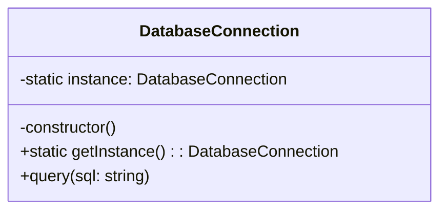

# Singleton Pattern (Mẫu Khởi Tạo Đơn Nhất)

**Singleton Pattern** là mẫu thiết kế thuộc nhóm **Creational (Khởi tạo)**. Nó đảm bảo rằng một Class chỉ có **duy nhất một thực thể (Instance)** được tạo ra trong suốt vòng đời của ứng dụng, và cung cấp một điểm truy cập toàn cầu (Global Access Point) tới thực thể đó.

---

## 1. Vấn đề thực tế

Trong lập trình Web (ví dụ như ExpressJS hay NestJS), có những đối tượng mà chúng ta **chỉ nên có duy nhất một thực thể duy nhất** dùng chung cho toàn bộ ứng dụng:
*   **Database Connection Pool:** Kết nối tới Cơ sở dữ liệu. Chúng ta không muốn mỗi lần cần truy vấn lại mở một kết nối mới, vì nó sẽ nhanh chóng làm tràn số lượng kết nối tối đa của Database (quá tải kết nối).
*   **Logger Service:** Ghi log hệ thống. Cần một file log duy nhất để ghi nhận sự kiện của toàn hệ thống một cách đồng bộ.
*   **Application Configuration:** Đọc các biến cấu hình từ file `.env` (chỉ cần đọc một lần và lưu vào bộ nhớ dùng chung).

Nếu không dùng Singleton, các lập trình viên khác có thể dùng từ khóa `new` khởi tạo vô số đối tượng, gây lãng phí tài nguyên và mất kiểm soát trạng thái dữ liệu.

---

## 2. Giải pháp của Singleton

Để ngăn chặn việc tạo ra nhiều đối tượng từ bên ngoài, Singleton áp dụng công thức **3 bước vàng**:

1.  **`private constructor`**: Đặt hàm khởi tạo của Class là `private`. Điều này ngăn cản tuyệt đối việc sử dụng từ khóa `new ClassName()` từ bên ngoài.
2.  **`private static instance`**: Tạo một biến tĩnh (`static`) và `private` ngay trong class để lưu giữ thực thể duy nhất.
3.  **`public static getInstance()`**: Cung cấp một phương thức tĩnh công khai. Phương thức này sẽ kiểm tra:
    *   Nếu `instance` chưa được tạo (bằng `null` hoặc `undefined`) $\rightarrow$ Khởi tạo nó một lần duy nhất.
    *   Nếu `instance` đã được tạo rồi $\rightarrow$ Chỉ việc trả về instance đó.



---

## 3. Cách triển khai bằng TypeScript (Lazy Initialization)

Dưới đây là cách triển khai chuẩn mực của Singleton Pattern:

```typescript
class DatabaseConnection {
  // Bước 2: Tạo biến static private để lưu instance duy nhất
  private static instance: DatabaseConnection | null = null;
  private connectionId: number;

  // Bước 1: Đặt constructor là private để chặn dùng "new" từ ngoài class
  private constructor() {
    this.connectionId = Math.random(); // Tạo ID ngẫu nhiên để nhận diện kết nối
    console.log(`[DB CONNECTED] Khởi tạo kết nối Database thành công! ID: ${this.connectionId}`);
  }

  // Bước 3: Phương thức static để truy cập instance từ ngoài
  public static getInstance(): DatabaseConnection {
    if (!DatabaseConnection.instance) {
      DatabaseConnection.instance = new DatabaseConnection();
    }
    return DatabaseConnection.instance;
  }

  // Một phương thức nghiệp vụ thông thường
  public query(sql: string): void {
    console.log(`[QUERY - Conn ID: ${this.connectionId}] Đang chạy câu lệnh: "${sql}"`);
  }
}
```

### Cách sử dụng ở Client:

```typescript
// ❌ Dòng này sẽ báo lỗi biên dịch ngay lập tức:
// const db = new DatabaseConnection(); 

// ✅ Cách gọi đúng qua getInstance():
const db1 = DatabaseConnection.getInstance();
db1.query("SELECT * FROM users");

const db2 = DatabaseConnection.getInstance();
db2.query("SELECT * FROM products");

// Kiểm tra xem hai biến có trỏ chung vào 1 thực thể (1 vùng nhớ) không:
console.log(db1 === db2); // Output: true (Hoàn toàn trùng khớp)
```

---

## 4. Ưu điểm và Nhược điểm của Singleton

### 👍 Ưu điểm:
*   **Tiết kiệm tài nguyên:** Tránh việc khởi tạo lặp đi lặp lại các đối tượng nặng (như DB connection, file Logger).
*   **Kiểm soát tài nguyên:** Dễ dàng kiểm soát số lượng kết nối hoặc giới hạn truy cập.
*   **Chia sẻ dữ liệu dễ dàng:** Vì là instance duy nhất toàn cục nên dễ chia sẻ dữ liệu/cấu hình xuyên suốt ứng dụng.

### 👎 Nhược điểm:
*   **Vi phạm Single Responsibility (SOLID):** Class Singleton vừa phải quản lý nghiệp vụ của nó, vừa phải tự quản lý vòng đời khởi tạo của chính nó.
*   **Khó viết Unit Test:** Do trạng thái của Singleton là toàn cục và tồn tại suốt vòng đời ứng dụng, các test case có thể ảnh hưởng lẫn nhau nếu không reset trạng thái cẩn thận.
*   **Che giấu sự phụ thuộc:** Các class khác gọi trực tiếp `DatabaseConnection.getInstance()` mà không thông qua khai báo tường minh trong constructor, khiến code khó tracking hơn. (Đó là lý do NestJS thay thế Singleton thuần túy bằng Dependency Injection).

---

## 🏁 Học thực hành tiếp theo

Hãy mở file **[index.ts](file:///Users/mapclient.001/Desktop/Work/Learning/BE/design-patterns/01-C-Singleton-pattern/index.ts)** trong thư mục này để xem toàn bộ code mẫu và chạy thử nghiệm bằng terminal nhé!
