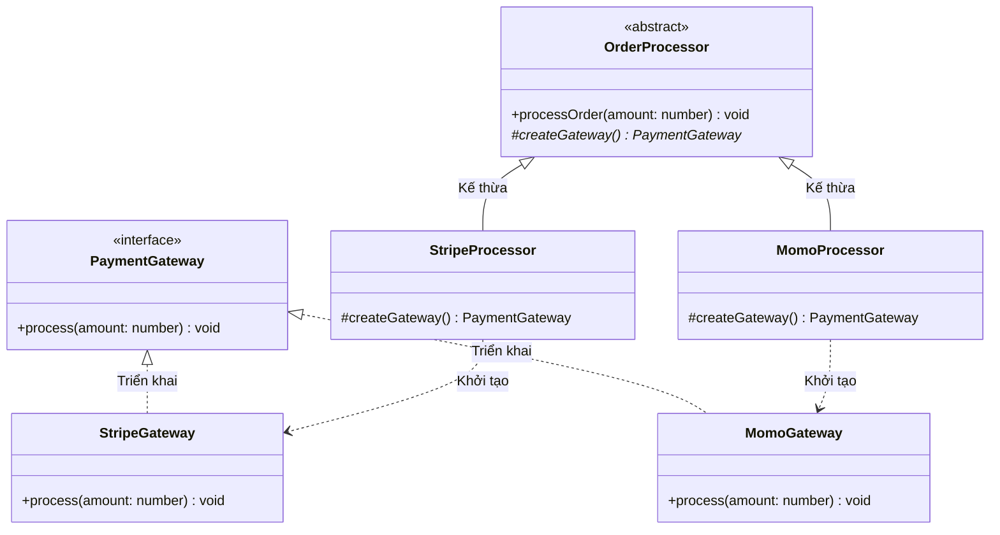

# Factory Method Pattern (Mẫu Phương Thức Nhà Máy)

**Factory Method Pattern** là mẫu thiết kế khởi tạo (Creational Pattern). Nó giải quyết bài toán khởi tạo đối tượng bằng cách định nghĩa một interface/abstract class để tạo đối tượng ở lớp cha, nhưng giao quyền quyết định khởi tạo lớp cụ thể nào cho các lớp con.

### 💡 Ví dụ đời thường dễ hiểu

- **Bối cảnh:** Bạn quản lý một chuỗi dịch vụ **Giao hàng (Logistics)**. Quy trình giao hàng chung luôn cố định: _Nhận hàng => **Tạo phương tiện vận chuyển** => Vận chuyển hàng => Ký nhận_.
- **Vấn đề:** Ban đầu bạn chỉ giao đường bộ nên mua toàn bộ **Xe tải** (giống như code cứng `new Truck()`). Khi công ty mở rộng sang giao hàng quốc tế, bạn không thể dùng xe tải để vượt đại dương mà cần **Tàu thủy**. Nếu sửa quy trình chung cho cả hai loại thì rất phức tạp và dễ gây lỗi.
- **Giải pháp (Factory Method):** Bạn để phương thức **Tạo phương tiện vận chuyển** ở dạng trừu tượng.
  - Chi nhánh **Đường bộ** tự quyết định tạo ra **Xe tải**.
  - Chi nhánh **Đường biển** tự quyết định tạo ra **Tàu thủy**.
  - Quy trình giao hàng cốt lõi của công ty vẫn giữ nguyên không thay đổi, chỉ có phương tiện được linh động thay đổi tùy theo chi nhánh.

---

## 1. Vấn đề thực tế

Trong ứng dụng thương mại điện tử, ban đầu hệ thống chỉ tích hợp cổng thanh toán **Stripe**:

```typescript
class OrderProcessor {
  public process() {
    const stripe = new StripeGateway(); // Hardcoded coupling
    stripe.charge();
  }
}
```

Khi cần tích hợp thêm **MoMo**, **ZaloPay**, code xử lý đơn hàng sẽ chằng chịt các khối lệnh `if-else` / `switch-case` để khởi tạo cổng tương ứng. Điều này vi phạm nguyên lý **Open/Closed Principle (OCP)** (mỗi lần thêm cổng thanh toán phải sửa code cũ) và **Single Responsibility Principle (SRP)**.

---

## 2. Giải pháp của Factory Method

Factory Method giải quyết vấn đề bằng cách tách biệt logic tạo đối tượng ra khỏi logic sử dụng. Lớp cha chỉ đưa ra quy trình xử lý nghiệp vụ chung, còn việc tạo ra đối tượng cụ thể (cổng thanh toán) sẽ do lớp con kế thừa thực hiện thông qua một phương thức trừu tượng (Factory Method).



### 🔍 Giải thích luồng chạy của Sơ đồ (Trace):

Khi bạn chạy code: `const processor = new MomoProcessor(); processor.processOrder(50000);`

1.  **Bước 1 (Gọi hàm):** Client gọi hàm `processOrder(50000)` từ đối tượng `MomoProcessor`.
2.  **Bước 2 (Chạy quy trình chung):** Vì `MomoProcessor` kế thừa (`<|--`) từ `OrderProcessor`, nên máy tính sẽ chạy hàm `processOrder()` nằm ở lớp cha.
3.  **Bước 3 (Kích hoạt Factory Method):** Bên trong hàm `processOrder()` của lớp cha có lệnh gọi `this.createGateway()`.
    *   Lúc này, `this` chính là `MomoProcessor`.
    *   Do đó, phương thức `createGateway()` của lớp con `MomoProcessor` được kích hoạt và khởi tạo (`..>`) ra đối tượng `MomoGateway`.
4.  **Bước 4 (Thanh toán):** Lớp cha nhận về đối tượng `MomoGateway` (dưới dạng interface `PaymentGateway`) và gọi `gateway.process(50000)` để hoàn tất thanh toán.

---

## 3. Cách triển khai bằng TypeScript

Dưới đây là cách triển khai tối giản của Factory Method Pattern:

```typescript
// Bước 1: Định nghĩa giao diện chung cho các đối tượng cần tạo (Trong GoF gọi là "Product")
interface PaymentGateway {
  process(amount: number): void;
}

// Bước 2: Triển khai các lớp cụ thể thực hiện nghiệp vụ (Trong GoF gọi là "Concrete Products")
class StripeGateway implements PaymentGateway {
  process(amount: number): void {
    console.log(`Thanh toán qua Stripe: $${amount}`);
  }
}

class MomoGateway implements PaymentGateway {
  process(amount: number): void {
    console.log(`Thanh toán qua MoMo: ${amount} VND`);
  }
}

// Bước 3: Lớp cha xử lý quy trình nghiệp vụ chính, chứa phương thức tạo đối tượng (Trong GoF gọi là "Creator")
abstract class OrderProcessor {
  // Phương thức nhà máy (Factory Method) để lấy đối tượng - Lớp cha chưa cần biết đối tượng cụ thể là gì
  protected abstract createGateway(): PaymentGateway;

  // Luồng nghiệp vụ chung của toàn hệ thống
  public processOrder(amount: number): void {
    const gateway = this.createGateway(); // Khởi tạo đối tượng gián tiếp qua Factory Method
    gateway.process(amount);
  }
}

// Bước 4: Các lớp con quyết định khởi tạo đối tượng cụ thể nào (Trong GoF gọi là "Concrete Creators")
class StripeProcessor extends OrderProcessor {
  protected createGateway(): PaymentGateway {
    return new StripeGateway();
  }
}

class MomoProcessor extends OrderProcessor {
  protected createGateway(): PaymentGateway {
    return new MomoGateway();
  }
}
```

### Cách sử dụng ở Client:

```typescript
const momoProcessor = new MomoProcessor();
momoProcessor.processOrder(50000); // Output: Thanh toán qua MoMo: 50000 VND

const stripeProcessor = new StripeProcessor();
stripeProcessor.processOrder(100); // Output: Thanh toán qua Stripe: $100
```

---

## 4. Ưu điểm và Nhược điểm

### 👍 Ưu điểm:

- **Loose Coupling (Liên kết lỏng lẻo):** Lớp cha không bị phụ thuộc vào các lớp con cụ thể.
- **Tuân thủ Open/Closed Principle (OCP):** Dễ dàng thêm cổng thanh toán mới (ví dụ: ZaloPay) bằng cách tạo lớp con mới mà không cần chỉnh sửa code cũ.
- **Tuân thủ Single Responsibility Principle (SRP):** Tách biệt logic tạo đối tượng ra khỏi logic nghiệp vụ.

### 👎 Nhược điểm:

- **Số lượng class tăng lên:** Bạn cần tạo thêm các lớp con mới cho mỗi sản phẩm mới, khiến cấu trúc code có thể trở nên cồng kềnh hơn.

---

## 🏁 Học thực hành tiếp theo

Hãy mở file **[index.ts](file:///Users/mapclient.001/Desktop/Work/Learning/BE/design-patterns/02-C-FactoryMethod-pattern/index.ts)** trong thư mục này để xem toàn bộ code mẫu chuyên sâu và chạy thử nghiệm bằng terminal nhé!
