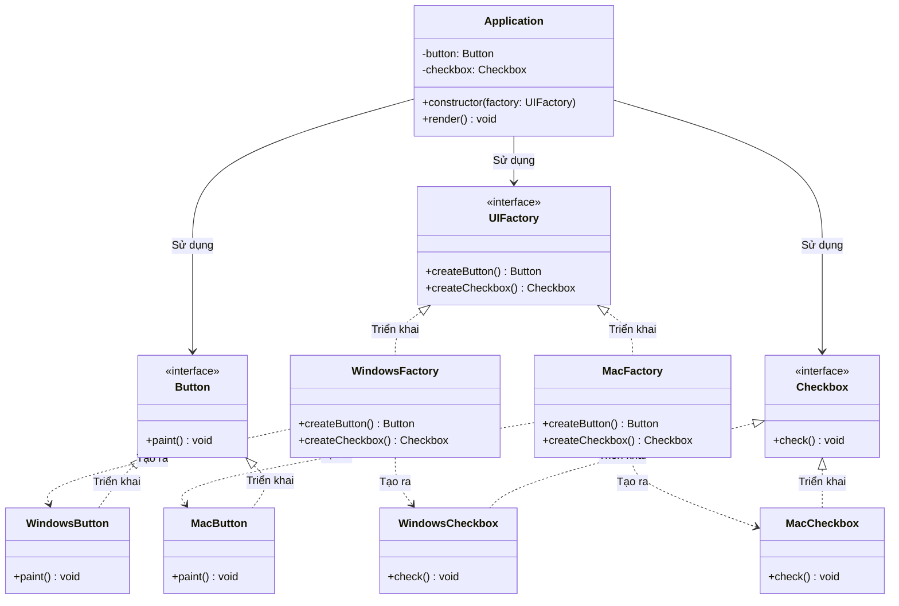

# Abstract Factory Pattern (Mẫu Nhà Máy Trừu Tượng)

**Abstract Factory Pattern** là mẫu thiết kế khởi tạo (Creational Pattern). Nó cung cấp một interface để tạo ra các họ đối tượng có liên quan hoặc phụ thuộc lẫn nhau (families of related or dependent objects) mà không cần chỉ ra các lớp cụ thể của chúng.

---

### 💡 Ví dụ đời thường dễ hiểu

- **Bối cảnh:** Bạn muốn mua một bộ nội thất để trang trí phòng khách bao gồm: **Ghế (Chair)**, **Bàn (Table)**, và **Sofa**.
- **Vấn đề:** Các sản phẩm này cần phải đồng bộ về phong cách thiết kế để căn phòng có thẩm mỹ tốt nhất. Nếu bạn phối một chiếc ghế phong cách **Hiện đại (Modern)** cùng với một cái bàn phong cách **Cổ điển (Victorian)**, tổng thể trông sẽ rất khập khiễng và lệch pha.
- **Giải pháp (Abstract Factory):** 
  - Thay vì đi mua lẻ từng món từ nhiều nguồn, bạn tìm đến một **Nhà máy sản xuất nội thất trừu tượng** (`FurnitureFactory`). Nhà máy này cam kết tạo ra các sản phẩm đồng bộ theo từng phong cách (Modern, Victorian, ArtDeco).
  - Nhà máy phong cách Hiện đại (`ModernFurnitureFactory`) sẽ chỉ tạo ra: `ModernChair`, `ModernTable`, và `ModernSofa`.
  - Nhà máy phong cách Cổ điển (`VictorianFurnitureFactory`) sẽ chỉ tạo ra: `VictorianChair`, `VictorianTable`, và `VictorianSofa`.
  - Bạn (Client code) chỉ cần yêu cầu phong cách mình muốn thông qua Factory tương ứng, và sẽ nhận lại được một bộ nội thất hoàn toàn tương thích với nhau mà không cần bận tâm chi tiết sản xuất từng món đồ ra sao.

---

## ⚖️ Phân biệt: Factory Method vs Abstract Factory

Rất nhiều nhà phát triển thường nhầm lẫn giữa hai mẫu thiết kế này. Dưới đây là bảng so sánh giúp bạn phân biệt rõ ràng:

| Tiêu chí | Factory Method | Abstract Factory |
| :--- | :--- | :--- |
| **Mục đích** | Tạo ra **một sản phẩm đơn lẻ** (Single Product) thông qua kế thừa lớp. | Tạo ra **một họ các sản phẩm liên quan** (Family of Products) thông qua composition. |
| **Cách triển khai** | Dựa trên **Sự kế thừa (Inheritance)**. Lớp cha định nghĩa phương thức trừu tượng, các lớp con ghi đè để quyết định tạo ra đối tượng nào. | Dựa trên **Đối tượng (Composition/Object delegation)**. Factory chính là một đối tượng chứa nhiều Factory Methods bên trong. |
| **Tầm ảnh hưởng** | Thay đổi cách tạo một sản phẩm cụ thể bằng cách tạo lớp con mới của Creator. | Thay đổi toàn bộ họ sản phẩm đồng bộ bằng cách truyền vào một Factory cụ thể khác cho Client. |
| **Ví dụ** | `OrderProcessor` tạo ra `MomoGateway` hoặc `StripeGateway`. | `UIFactory` tạo ra một bộ gồm `{ Button, Checkbox, TextBox }` tương thích với Windows, macOS hoặc Linux. |

---

## 1. Vấn đề thực tế

Giả sử bạn đang xây dựng một bộ công cụ thiết kế giao diện UI (UI Kit) hoạt động đa nền tảng (**Windows** và **macOS**).
Mỗi nền tảng yêu cầu các component có giao diện hiển thị và hành vi đặc trưng riêng biệt:
- Trên Windows: Cần vẽ `WindowsButton` và `WindowsCheckbox`.
- Trên macOS: Cần vẽ `MacButton` và `MacCheckbox`.

Nếu bạn viết code cứng (Hardcoded coupling) như sau:
```typescript
class Application {
  public render(os: string) {
    let button;
    let checkbox;
    
    if (os === "Windows") {
      button = new WindowsButton();
      checkbox = new WindowsCheckbox();
    } else if (os === "macOS") {
      button = new MacButton();
      checkbox = new MacCheckbox();
    }
    // Vẽ UI...
  }
}
```
Đoạn code trên vi phạm nghiêm trọng nguyên lý **Open/Closed Principle (OCP)**. Khi bạn muốn hỗ trợ thêm hệ điều hành **Linux**, bạn buộc phải sửa đổi lớp `Application`, thêm các nhánh `else-if` mới và import thêm các lớp `LinuxButton`, `LinuxCheckbox`.

---

## 2. Giải pháp của Abstract Factory

Abstract Factory giải quyết bài toán này bằng cách yêu cầu bạn định nghĩa rõ ràng các giao diện chung (Abstract Products) cho mỗi loại thành phần trong họ sản phẩm (ví dụ: `Button` và `Checkbox`). 

Sau đó, bạn tạo một giao diện nhà máy chung (`UIFactory`) khai báo các phương thức tạo ra từng thành phần đó. Cuối cùng, các nhà máy cụ thể (`WindowsFactory`, `MacFactory`) sẽ chịu trách nhiệm sản xuất ra các biến thể tương ứng đảm bảo đồng bộ hoàn toàn.



---

## 3. Cách triển khai bằng TypeScript

Dưới đây là khung code tối giản thể hiện Abstract Factory Pattern:

```typescript
// --- Bước 1: Định nghĩa giao diện cho các sản phẩm trừu tượng (Abstract Products) ---
interface Button {
  paint(): void;
}

interface Checkbox {
  check(): void;
}

// --- Bước 2: Triển khai các biến thể sản phẩm cụ thể (Concrete Products) ---
class WindowsButton implements Button {
  paint(): void {
    console.log("Đang vẽ Button phong cách Windows vuông vắn.");
  }
}

class MacButton implements Button {
  paint(): void {
    console.log("Đang vẽ Button phong cách macOS bo tròn bóng bẩy.");
  }
}

class WindowsCheckbox implements Checkbox {
  check(): void {
    console.log("Đang tích chọn Checkbox kiểu Windows [X].");
  }
}

class MacCheckbox implements Checkbox {
  check(): void {
    console.log("Đang tích chọn Checkbox kiểu macOS [✓].");
  }
}

// --- Bước 3: Khai báo giao diện Nhà máy trừu tượng (Abstract Factory) ---
interface UIFactory {
  createButton(): Button;
  createCheckbox(): Checkbox;
}

// --- Bước 4: Triển khai các nhà máy cụ thể (Concrete Factories) ---
class WindowsFactory implements UIFactory {
  createButton(): Button {
    return new WindowsButton();
  }
  createCheckbox(): Checkbox {
    return new WindowsCheckbox();
  }
}

class MacFactory implements UIFactory {
  createButton(): Button {
    return new MacButton();
  }
  createCheckbox(): Checkbox {
    return new MacCheckbox();
  }
}

// --- Bước 5: Client code sử dụng Factory thông qua interface trừu tượng ---
class Application {
  private button: Button;
  private checkbox: Checkbox;

  constructor(factory: UIFactory) {
    // Client hoàn toàn độc lập với các class WindowsButton hay MacButton cụ thể
    this.button = factory.createButton();
    this.checkbox = factory.createCheckbox();
  }

  public render(): void {
    this.button.paint();
    this.checkbox.check();
  }
}
```

### Cách sử dụng ở Client:

```typescript
// Ứng dụng chạy trên Windows
const winFactory = new WindowsFactory();
const appWin = new Application(winFactory);
appWin.render();
// Output:
// Đang vẽ Button phong cách Windows vuông vắn.
// Đang tích chọn Checkbox kiểu Windows [X].

// Khi chuyển cấu hình chạy trên macOS
const macFactory = new MacFactory();
const appMac = new Application(macFactory);
appMac.render();
// Output:
// Đang vẽ Button phong cách macOS bo tròn bóng bẩy.
// Đang tích chọn Checkbox kiểu macOS [✓].
```

---

## 4. Ưu điểm và Nhược điểm

### 👍 Ưu điểm:
- **Đảm bảo tính đồng bộ (Product Compatibility):** Giúp tránh được tình trạng phối hợp các sản phẩm không tương thích trong cùng một môi trường.
- **Loose Coupling (Liên kết lỏng lẻo):** Client code chỉ làm việc với các interfaces/abstract classes, không bị phụ thuộc vào các triển khai cụ thể của sản phẩm hay nhà máy.
- **Tuân thủ Single Responsibility Principle (SRP):** Gom toàn bộ code tạo dựng sản phẩm vào một nơi tập trung (các Factory cụ thể).
- **Tuân thủ Open/Closed Principle (OCP):** Khi cần giới thiệu một dòng sản phẩm mới (ví dụ: UI cho Linux), bạn chỉ cần viết các lớp sản phẩm mới và một Factory mới mà không làm hỏng code hiện tại.

### 👎 Nhược điểm:
- **Khó mở rộng loại sản phẩm mới (New product type):** Nếu bạn muốn bổ sung thêm một sản phẩm mới vào họ sản phẩm (ví dụ: thêm thành phần `TextBox` vào `UIFactory`), bạn bắt buộc phải sửa đổi interface `UIFactory` và tất cả các Concrete Factories kế thừa nó. Đây được gọi là "Abstract Factory Interface Stability Rule".

---

## 🏁 Học thực hành tiếp theo

Hãy mở file **[index.ts](file:///Users/mapclient.001/Desktop/Work/Learning/BE/design-patterns/03-C-AbstractFactory-pattern/index.ts)** để bắt đầu khám phá mã nguồn mô phỏng chi tiết hệ thống UI Kit đa nền tảng nhé!
