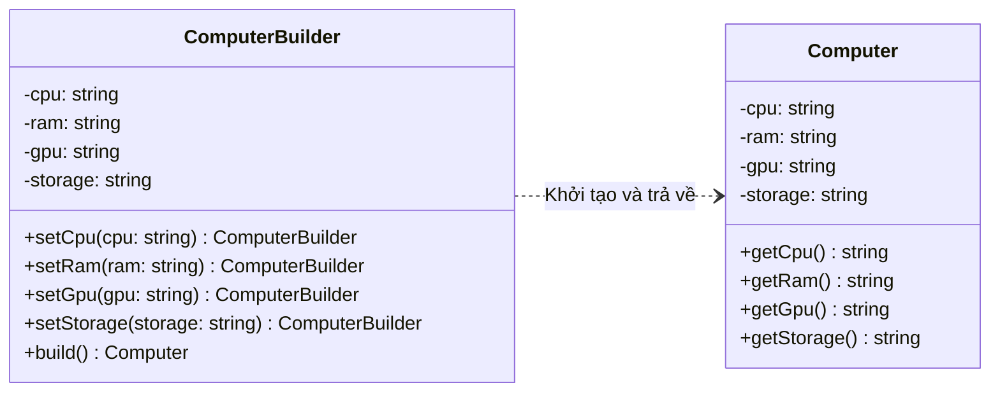

# Builder Pattern (Mẫu Người Dựng)

**Builder Pattern** là một mẫu thiết kế khởi tạo (Creational Pattern). Nó giúp tách biệt quá trình xây dựng một đối tượng phức tạp ra khỏi biểu diễn của nó, cho phép cùng một quá trình xây dựng có thể tạo ra các biểu diễn (kết quả) khác nhau.

---

### 💡 Ví dụ đời thường dễ hiểu

- **Bối cảnh:** Bạn vào một cửa hàng và đặt một **Cốc trà sữa (Bubble Tea)**.
- **Vấn đề:** Trà sữa có rất nhiều tùy chọn tùy biến:
  - Cỡ cốc: `S`, `M`, `L`.
  - Lượng đường: `0%`, `30%`, `50%`, `70%`, `100%`.
  - Lượng đá: `0%`, `50%`, `100%`.
  - Các loại Topping: Trân châu đen, Trân châu trắng, Thạch nha đam, Kem cheese, Thạch pudding...
  - Nếu nhân viên cửa hàng bắt bạn phải gọi đúng một câu lệnh dài chứa mọi thông số như: `new BubbleTea("L", 50, 100, true, false, true, false)` thì bạn rất dễ nhầm lẫn thứ tự các thành phần.
- **Giải pháp (Builder):**
  - Cửa hàng đưa cho bạn một tờ phiếu chọn (đóng vai trò là **Builder**). Bạn tích lần lượt từng yêu cầu của mình:
    - `.setSize("L")`
    - `.setSugar("50%")`
    - `.addBlackPearl()`
    - `.addCheeseCream()`
  - Cuối cùng, bạn gửi phiếu cho nhân viên pha chế và họ gọi lệnh `.build()` để trao lại cho bạn đúng cốc trà sữa bạn mong muốn.

---

## 1. Vấn đề thực tế

Trong lập trình, khi thiết kế một lớp đối tượng phức tạp có nhiều thuộc tính (trong đó có một số thuộc tính bắt buộc và nhiều thuộc tính tùy chọn), chúng ta thường gặp phải hai vấn đề lớn:

### Vấn đề 1: Telescoping Constructor (Constructor xếp chồng)

Để đáp ứng nhiều cấu hình khác nhau, chúng ta phải tạo ra hàng loạt Constructor overload:

```typescript
class Computer {
  constructor(cpu: string, ram: string); // cấu hình tối thiểu
  constructor(cpu: string, ram: string, gpu: string);
  constructor(cpu: string, ram: string, gpu: string, storage: string);
  constructor(
    cpu: string,
    ram: string,
    gpu: string,
    storage: string,
    bluetooth: boolean,
  );
  // ...
}
```

Việc này làm code cực kỳ rối rắm, khó bảo trì và dễ gán nhầm giá trị khi các tham số có cùng kiểu dữ liệu (ví dụ truyền nhầm thứ tự giữa GPU và Storage).

### Vấn đề 2: Object Inconsistency (Đối tượng không nhất quán)

Một giải pháp khác là dùng một Constructor mặc định không tham số, sau đó sử dụng các hàm Setter để gán giá trị:

```typescript
const pc = new Computer();
pc.setCpu("Intel i9");
pc.setRam("32GB");
// Ở giữa chừng, đối tượng pc bị gửi đi xử lý khi chưa được gán ổ cứng Storage -> Lỗi logic!
```

Sử dụng Setter khiến đối tượng bị thay đổi trạng thái liên tục (mutable) và có thể rơi vào trạng thái thiếu nhất quán ở các bước trung gian trước khi được cấu hình đầy đủ.

---

## 2. Giải pháp của Builder Pattern

Builder Pattern giải quyết các vấn đề trên bằng cách:

1. Tạo ra một đối tượng Builder riêng biệt để thiết lập từng thuộc tính từng bước một thông qua các phương thức tiện ích.
2. Trả về chính đối tượng Builder (`return this`) sau mỗi phương thức để hỗ trợ viết code dạng chuỗi (**Fluent API** / **Method Chaining**).
3. Đảm bảo đối tượng chính chỉ được tạo ra khi gọi phương thức `.build()`, giúp đối tượng chính có thể thiết kế ở dạng bất biến (**Immutable** - chỉ có getter, không có setter).



---

## 3. Cách triển khai bằng TypeScript

Dưới đây là cách triển khai Builder Pattern chuẩn hóa:

```typescript
// Bước 1: Định nghĩa lớp đối tượng chính (Product) - Thường là Immutable
class Computer {
  private readonly cpu: string;
  private readonly ram: string;
  private readonly gpu?: string; // Thuộc tính tùy chọn
  private readonly storage?: string; // Thuộc tính tùy chọn

  // Constructor ở dạng private để bắt buộc phải khởi tạo qua Builder
  constructor(builder: ComputerBuilder) {
    this.cpu = builder.cpu;
    this.ram = builder.ram;
    this.gpu = builder.gpu;
    this.storage = builder.storage;
  }

  public displayConfig(): void {
    console.log(
      `Cấu hình PC: CPU: ${this.cpu}, RAM: ${this.ram}, GPU: ${this.gpu || "None"}, Storage: ${this.storage || "None"}`,
    );
  }
}

// Bước 2: Định nghĩa lớp dựng đối tượng (Builder)
class ComputerBuilder {
  public cpu!: string;
  public ram!: string;
  public gpu?: string;
  public storage?: string;

  // Fluent API: Trả về chính `this` để nối chuỗi phương thức
  public setCpu(cpu: string): this {
    this.cpu = cpu;
    return this;
  }

  public setRam(ram: string): this {
    this.ram = ram;
    return this;
  }

  public setGpu(gpu: string): this {
    this.gpu = gpu;
    return this;
  }

  public setStorage(storage: string): this {
    this.storage = storage;
    return this;
  }

  // Phương thức cuối cùng để kiểm tra tính hợp lệ và trả về Product hoàn chỉnh
  public build(): Computer {
    if (!this.cpu || !this.ram) {
      throw new Error("Không thể lắp ráp PC thiếu CPU hoặc RAM!");
    }
    return new Computer(this);
  }
}
```

### Cách sử dụng ở Client:

```typescript
// Sử dụng Fluent API cực kỳ rõ ràng và sạch sẽ
const gamingPC = new ComputerBuilder()
  .setCpu("Intel Core i9")
  .setRam("32GB DDR5")
  .setGpu("Nvidia RTX 4090")
  .setStorage("2TB NVMe SSD")
  .build();

gamingPC.displayConfig();
// Output: Cấu hình PC: CPU: Intel Core i9, RAM: 32GB DDR5, GPU: Nvidia RTX 4090, Storage: 2TB NVMe SSD

// Một cấu hình PC văn phòng tối giản (không chọn GPU và Storage)
const officePC = new ComputerBuilder()
  .setCpu("Intel Core i3")
  .setRam("8GB")
  .build();

officePC.displayConfig();
// Output: Cấu hình PC: CPU: Intel Core i3, RAM: 8GB, GPU: None, Storage: None
```

---

## 4. Ưu điểm và Nhược điểm

### 👍 Ưu điểm:

- **Tạo dựng từng bước (Step-by-step Construction):** Cho phép hoãn hoặc thực hiện các bước tạo dựng một cách linh hoạt, lặp đi lặp lại hoặc đệ quy.
- **Fluent API:** Viết code cực kỳ tường minh, dễ đọc, giảm thiểu sai sót khi truyền tham số.
- **Đảm bảo tính bất biến (Immutability):** Giúp tạo ra các đối tượng an toàn với đa luồng (thread-safe) vì trạng thái của chúng không bị thay đổi sau khi được tạo.
- **Single Responsibility Principle (SRP):** Tách biệt mã nguồn xây dựng phức tạp ra khỏi lớp nghiệp vụ chính của đối tượng.

### 👎 Nhược điểm:

- **Tăng số lượng class:** Bắt buộc phải viết thêm một lớp Builder song song cho mỗi Product, làm tăng lượng code ban đầu (boilerplate code).
- **Phụ thuộc chặt chẽ:** Lớp Builder liên kết chặt chẽ với lớp Product. Nếu Product thay đổi hoặc thêm thuộc tính mới, Builder cũng bắt buộc phải cập nhật theo.

---

## 🏁 Học thực hành tiếp theo

Hãy mở file **[index.ts](file:///Users/mapclient.001/Desktop/Work/Learning/BE/design-patterns/04-C-Builder-pattern/index.ts)** để bắt đầu khám phá ví dụ xây dựng bộ sinh câu truy vấn SQL động đầy sinh động nhé!
