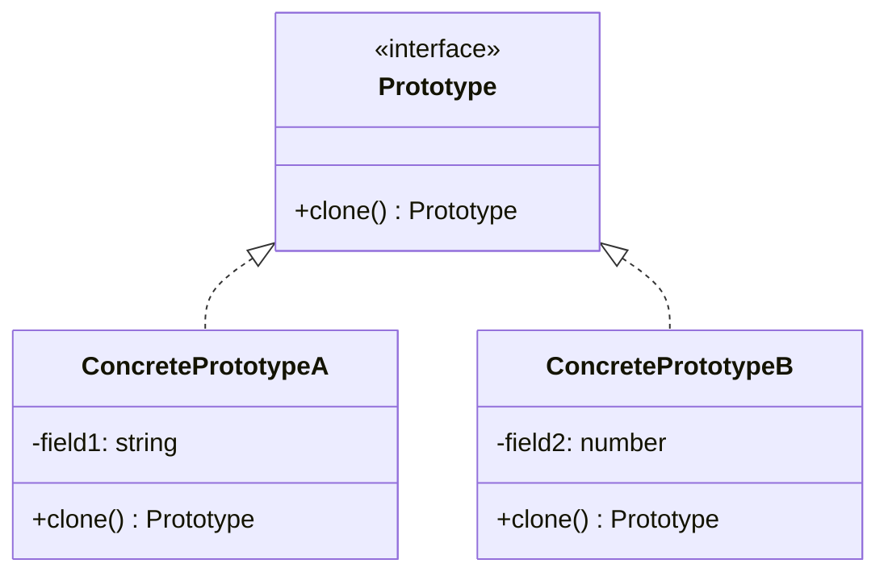

# Prototype Pattern (Mẫu Nguyên Mẫu)

**Prototype Pattern** là một mẫu thiết kế khởi tạo (Creational Pattern). Nó cho phép sao chép các đối tượng hiện có mà không làm cho mã nguồn của bạn phụ thuộc vào các lớp cụ thể của chúng. Nói cách khác, bạn nhân bản (clone) một đối tượng nguyên bản có sẵn để tạo ra một đối tượng mới, thay vì tạo mới từ đầu bằng từ khóa `new` rồi thiết lập lại các thuộc tính.

---

### 💡 Ví dụ đời thường dễ hiểu

- **Bối cảnh:** Bạn đang soạn thảo một **Hợp đồng lao động (Contract)** cho một nhân viên mới.
- **Vấn đề:** Hợp đồng có rất nhiều điều khoản pháp lý phức tạp, thông tin công ty, chữ ký của giám đốc đại diện... Tất cả những thông tin này đều giống nhau 99% cho mọi nhân viên. Nếu mỗi lần tuyển người mới bạn lại phải viết hoặc gõ lại toàn bộ hợp đồng từ đầu, việc này cực kỳ tốn thời gian và dễ sai sót.
- **Giải pháp (Prototype):**
  - Bạn tạo sẵn một **Hợp đồng mẫu (Template/Prototype)** đã điền sẵn thông tin công ty, các điều khoản chung.
  - Mỗi khi có nhân viên mới, bạn chỉ cần **Photocopy (Clone)** hợp đồng mẫu đó ra một bản sao mới.
  - Trên bản sao này, bạn chỉ việc sửa lại tên nhân viên, mức lương và ngày bắt đầu làm việc. Toàn bộ các thông tin phức tạp và điều khoản pháp lý khác đã được sao chép nguyên vẹn từ bản mẫu.

---

## 1. Vấn đề thực tế

Trong phát triển phần mềm, đôi khi chúng ta cần tạo ra nhiều đối tượng có trạng thái giống nhau hoặc chỉ khác nhau một vài chi tiết nhỏ. Nếu khởi tạo từ đầu bằng `new`:

1. **Chi phí khởi tạo lớn (Costly Initialization):** Việc tạo mới một đối tượng có thể đòi hỏi các thao tác nặng nề như truy vấn cơ sở dữ liệu, đọc tệp cấu hình, tải tài nguyên hình ảnh/âm thanh từ mạng.
2. **Phụ thuộc vào lớp cụ thể (Tight Coupling):** Để tạo đối tượng, Client phải biết rõ tên lớp cụ thể của đối tượng đó (ví dụ: `new Warrior()`, `new Mage()`), làm giảm khả năng mở rộng.
3. **Trạng thái phức tạp:** Đối tượng có thể có cấu trúc phân cấp lồng nhau sâu sắc, đòi hỏi thiết lập rất nhiều tham số phức tạp mới đạt đến trạng thái mong muốn.

---

## 2. Giải pháp của Prototype Pattern

Prototype Pattern giải quyết vấn đề bằng cách định nghĩa một giao diện chung có phương thức sao chép (thường đặt tên là `clone()`).

- Đối tượng có khả năng nhân bản tự chịu trách nhiệm sao chép chính nó.
- Client chỉ cần tương tác với giao diện chung và gọi phương thức `clone()` để nhận về một bản sao độc lập của đối tượng.



---

## 3. Phân biệt Shallow Copy và Deep Copy

Khi sao chép đối tượng trong JavaScript/TypeScript, chúng a cần đặc biệt chú ý tới cách nhân bản các thuộc tính là kiểu tham chiếu (Objects, Arrays):

### Shallow Copy (Sao chép nông)
Chỉ sao chép các giá trị nguyên bản (primitive values) và các tham chiếu đến các đối tượng lồng bên trong. Điều này nghĩa là nếu đối tượng gốc có một thuộc tính là một object khác, cả đối tượng gốc và đối tượng sao chép sẽ **dùng chung** object lồng đó. Thay đổi object lồng ở bản sao sẽ làm thay đổi cả bản gốc!
*Cách thực hiện trong JS:* Dùng toán tử Spread `{...original}` hoặc `Object.assign({}, original)`.

### Deep Copy (Sao chép sâu)
Sao chép toàn bộ đối tượng, bao gồm cả các đối tượng lồng bên trong một cách đệ quy. Đối tượng sao chép mới sẽ hoàn toàn độc lập và không chia sẻ bất kỳ tham chiếu bộ nhớ nào với đối tượng gốc.
*Cách thực hiện trong JS:*
1. Sử dụng hàm chuẩn hiện đại: `structuredClone(original)` (Khuyến nghị cho môi trường Node.js mới và trình duyệt hiện đại).
2. Sử dụng JSON: `JSON.parse(JSON.stringify(original))` (Đơn giản nhưng có hạn chế: làm mất các phương thức, biến đổi kiểu dữ liệu `Date`, `RegExp`, `Map`, `Set`, `undefined`...).
3. Tự viết hàm đệ quy sao chép thủ công.

---

## 4. Cách triển khai bằng TypeScript

Dưới đây là ví dụ triển khai cơ bản của Prototype Pattern:

```typescript
// Bước 1: Định nghĩa Interface có phương thức clone
interface Prototype {
  clone(): this;
}

// Bước 2: Triển khai cụ thể ở lớp đối tượng
class GameCharacter implements Prototype {
  public name: string;
  public level: number;
  public equipment: string[];

  constructor(name: string, level: number, equipment: string[]) {
    this.name = name;
    this.level = level;
    this.equipment = equipment;
  }

  // Thực hiện Deep Copy để đảm bảo mảng equipment không bị dùng chung
  public clone(): this {
    // Nhân bản các thuộc tính cơ bản
    const cloneCharacter = Object.create(Object.getPrototypeOf(this));
    cloneCharacter.name = this.name;
    cloneCharacter.level = this.level;
    
    // Sao chép sâu thuộc tính dạng mảng/đối tượng
    cloneCharacter.equipment = [...this.equipment]; 
    
    return cloneCharacter;
  }

  public display(): void {
    console.log(`Nhân vật: ${this.name} | Cấp: ${this.level} | Trang bị: ${this.equipment.join(", ")}`);
  }
}
```

### Cách sử dụng ở Client:

```typescript
// Tạo đối tượng gốc (Prototype)
const baseKnight = new GameCharacter("Hiệp sĩ cơ bản", 1, ["Kiếm sắt", "Giáp da"]);
baseKnight.display(); // Hiệp sĩ cơ bản | Cấp: 1 | Giáp da, Kiếm sắt

// Nhân bản từ đối tượng gốc
const shadowKnight = baseKnight.clone();
shadowKnight.name = "Hiệp sĩ bóng đêm";
shadowKnight.equipment.push("Khiên bóng tối"); // Chỉ ảnh hưởng tới bản sao

shadowKnight.display(); // Hiệp sĩ bóng đêm | Cấp: 1 | Kiếm sắt, Giáp da, Khiên bóng tối
baseKnight.display();   // Hiệp sĩ cơ bản | Cấp: 1 | Kiếm sắt, Giáp da (Không bị thay đổi)
```

---

## 5. Ưu điểm và Nhược điểm

### 👍 Ưu điểm:
- **Tách biệt mã nguồn:** Client không cần phụ thuộc vào các lớp cụ thể mà nó nhân bản.
- **Tiết kiệm hiệu năng:** Tránh việc thực hiện lại các thủ tục khởi tạo phức tạp hoặc tốn tài nguyên.
- **Linh hoạt cấu hình:** Cho phép tạo sẵn các đối tượng cấu hình mẫu (Prototype Registry) rồi nhân bản chúng một cách nhanh chóng.
- **Thay thế Subclassing:** Giúp giảm thiểu số lượng lớp con thừa kế chỉ khác nhau về cấu hình ban đầu.

### 👎 Nhược điểm:
- **Khó khăn khi xử lý Deep Copy:** Việc nhân bản sâu các đối tượng có cấu trúc phức tạp chứa tham chiếu vòng (circular references) hoặc các tài nguyên hệ thống (stream, database connection...) rất khó khăn và dễ gây lỗi.

---

## 🏁 Học thực hành tiếp theo

Hãy mở file **[index.ts](file:///Users/mapclient.001/Desktop/Work/Learning/BE/design-patterns/05-C-Prototype-pattern/index.ts)** để bắt đầu khám phá hệ thống đăng ký và nhân bản quái vật trong game (Monster Spawner System) cực kỳ thú vị nhé!
