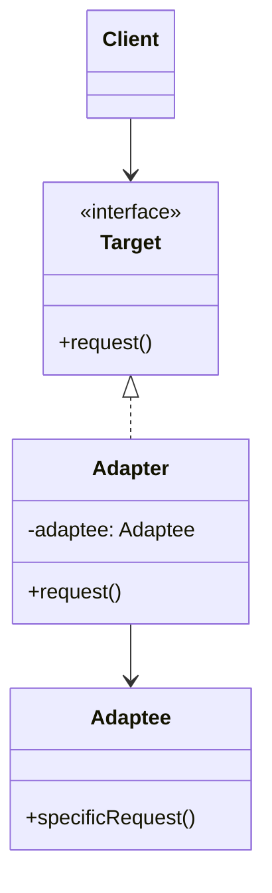

# Adapter Pattern (Mẫu Bộ Chuyển Đổi)

**Adapter Pattern** là một mẫu thiết kế cấu trúc (Structural Pattern). Nó hoạt động như một cầu nối giữa hai giao diện (interface) không tương thích, giúp các lớp vốn không thể làm việc cùng nhau do khác biệt về giao diện có thể kết hợp hoạt động một cách mượt mà.

---

### 💡 Ví dụ đời thường dễ hiểu

- **Bối cảnh:** Bạn mua một chiếc laptop cao cấp mới (ví dụ MacBook Pro M1/M2/M3) chỉ trang bị cổng **USB Type-C**.
- **Vấn đề:** Bạn cần cắm một chiếc **USB Flash Drive đời cũ (cổng USB Type-A)** hoặc cắm dây mạng **LAN (cổng RJ45)** vào máy để làm việc. Bản thân cổng Type-C và đầu cắm Type-A/RJ45 hoàn toàn không khớp nhau về mặt vật lý cũng như tín hiệu truyền dẫn.
- **Giải pháp (Adapter):** 
  - Bạn mua một **Hub chuyển đổi đa năng (Adapter)**.
  - Một đầu của Hub cắm vào cổng **USB Type-C** trên laptop.
  - Đầu kia của Hub cung cấp các khe cắm **USB Type-A, HDMI, RJ45** để bạn cắm các thiết bị cũ của mình vào.
  - Thiết bị Hub chuyển đổi này chính là một **Adapter** trong đời thực, chuyển đổi giao diện đầu vào của cổng Type-C thành giao diện phù hợp với các chuẩn kết nối cũ.

---

## 1. Vấn đề thực tế

Trong phát triển phần mềm, kịch bản tương tự xảy ra rất phổ biến:
1. **Tích hợp thư viện bên thứ ba (Third-party integration):** Hệ thống của bạn mong đợi dữ liệu ở một định dạng (ví dụ: JSON), nhưng thư viện bên thứ ba hoặc API của đối tác chỉ trả về dữ liệu ở định dạng khác (ví dụ: XML, CSV).
2. **Nâng cấp mã nguồn cũ (Legacy Code):** Bạn có một lớp cũ (Legacy Class) hoạt động rất tốt và đã được kiểm thử kỹ lưỡng, nhưng giao diện của nó không còn tương thích với các interface tiêu chuẩn mới của hệ thống. Thay đổi trực tiếp lớp cũ có thể làm hỏng các phần khác đang chạy ổn định.
3. **Độc lập và giảm phụ thuộc (Loose Coupling):** Bạn muốn bảo vệ mã nguồn nghiệp vụ cốt lõi (Core Business Logic) của mình khỏi sự thay đổi giao diện liên tục từ phía các dịch vụ bên ngoài.

---

## 2. Giải pháp của Adapter Pattern

Adapter Pattern đề xuất tạo ra một lớp trung gian (gọi là **Adapter**) đóng vai trò dịch ngôn ngữ giữa Client và lớp không tương thích (**Adaptee**).

- **Target (Interface mong muốn):** Giao diện tiêu chuẩn mà Client hiểu và muốn sử dụng.
- **Adaptee (Lớp cần chuyển đổi):** Lớp chứa các chức năng hữu ích nhưng có giao diện không tương thích.
- **Adapter (Bộ chuyển đổi):** Lớp thực thi giao diện `Target`, đồng thời giữ một tham chiếu đến đối tượng `Adaptee`. Khi Client gọi phương thức trên `Adapter`, nó sẽ chuyển đổi tham số và ủy quyền xử lý (delegate) cho `Adaptee`.



---

## 3. Phân loại Adapter Pattern

Có hai cách tiếp cận chính để triển khai Adapter Pattern:

### 1. Object Adapter (Bộ chuyển đổi đối tượng - Khuyên dùng)
Sử dụng nguyên lý **Composition (Thành phần)**. Lớp Adapter chứa một instance (thể hiện) của Adaptee trong thuộc tính của nó. 
- *Ưu điểm:* Rất linh hoạt, một Adapter có thể hoạt động với Adaptee và tất cả các lớp con của nó. 
- *Cách thực hiện trong JS/TS:* Đây là cách duy nhất khả thi khi muốn chuyển đổi các interface hoặc class bình thường vì JavaScript/TypeScript không hỗ trợ đa kế thừa lớp (Multiple Inheritance).

### 2. Class Adapter (Bộ chuyển đổi lớp)
Sử dụng nguyên lý **Inheritance (Kế thừa)**. Adapter kế thừa từ cả Target class lẫn Adaptee class cùng một lúc.
- *Ưu điểm:* Có thể ghi đè (override) hành vi của Adaptee trực tiếp nếu cần thiết.
- *Hạn chế:* Chỉ khả thi trong các ngôn ngữ hỗ trợ đa kế thừa như C++, Python. Trong TypeScript, bạn chỉ có thể áp dụng nếu một trong hai bên (thường là Target) là một **Interface** chứ không phải một **Class**.

---

## 4. Cách triển khai bằng TypeScript (Object Adapter)

Dưới đây là một ví dụ thực tế chuyển đổi từ một **Dịch vụ thời tiết cũ trả về XML** sang **Interface thời tiết chuẩn trả về JSON**:

```typescript
// 1. Target Interface: Định dạng mà ứng dụng của bạn yêu cầu
interface ModernWeatherService {
  getWeatherInCelsius(city: string): { city: string; tempC: number; condition: string };
}

// 2. Adaptee: Lớp cũ trả về dữ liệu định dạng XML không tương thích
class LegacyXmlWeatherService {
  public getXmlWeatherData(city: string): string {
    // Giả lập trả về chuỗi XML
    if (city.toLowerCase() === "hanoi") {
      return `<weather><city>Hanoi</city><temp_f>86</temp_f><desc>Sunny</desc></weather>`;
    }
    return `<weather><city>${city}</city><temp_f>77</temp_f><desc>Cloudy</desc></weather>`;
  }
}

// 3. Adapter: Chuyển đổi XML của lớp cũ thành định dạng JSON chuẩn
class WeatherAdapter implements ModernWeatherService {
  private legacyService: LegacyXmlWeatherService;

  constructor(legacyService: LegacyXmlWeatherService) {
    this.legacyService = legacyService;
  }

  public getWeatherInCelsius(city: string) {
    // B1: Lấy dữ liệu XML từ dịch vụ cũ
    const xmlData = this.legacyService.getXmlWeatherData(city);
    
    // B2: Phân tích XML (giả lập phân tích chuỗi đơn giản)
    const cityMatch = xmlData.match(/<city>(.*?)<\/city>/);
    const tempFMatch = xmlData.match(/<temp_f>(.*?)<\/temp_f>/);
    const descMatch = xmlData.match(/<desc>(.*?)<\/desc>/);

    const cityName = cityMatch ? cityMatch[1] : city;
    const tempF = tempFMatch ? parseFloat(tempFMatch[1]) : 32;
    const condition = descMatch ? descMatch[1] : "Unknown";

    // B3: Chuyển đổi dữ liệu độ F sang độ C (Formula: (F - 32) * 5/9)
    const tempC = Math.round((tempF - 32) * 5 / 9);

    // B4: Trả về kết quả theo cấu trúc JSON mong đợi
    return {
      city: cityName,
      tempC: tempC,
      condition: condition
    };
  }
}
```

### Cách sử dụng ở Client:

```typescript
// Tạo dịch vụ cũ (Adaptee)
const legacyService = new LegacyXmlWeatherService();

// Bọc dịch vụ cũ bằng Adapter
const appWeatherService: ModernWeatherService = new WeatherAdapter(legacyService);

// Client sử dụng dịch vụ mới thông qua interface chuẩn JSON
const weather = appWeatherService.getWeatherInCelsius("Hanoi");
console.log(weather);
// Output: { city: 'Hanoi', tempC: 30, condition: 'Sunny' }
```

---

## 5. Ưu điểm và Nhược điểm

### 👍 Ưu điểm:
- **Nguyên lý Single Responsibility (Đơn nhiệm):** Tách biệt logic chuyển đổi dữ liệu khỏi logic nghiệp vụ chính của ứng dụng.
- **Nguyên lý Open/Closed (Đóng/Mở):** Bạn có thể giới thiệu các kiểu Adapter mới vào chương trình mà không làm ảnh hưởng đến mã nguồn Client hiện tại.
- **Tái sử dụng mã nguồn tốt:** Cho phép tái sử dụng các lớp cũ, thư viện bên ngoài mà không cần sửa đổi mã nguồn gốc của chúng.

### 👎 Nhược điểm:
- **Tăng độ phức tạp mã nguồn:** Do phải viết thêm nhiều interface, class Adapter mới, khiến hệ thống trở nên cồng kềnh hơn (đặc biệt khi bạn có thể chỉ cần viết một hàm chuyển đổi đơn giản).

---

## 🏁 Học thực hành tiếp theo

Hãy mở file **[index.ts](file:///Users/mapclient.001/Desktop/Work/Learning/BE/design-patterns/06-S-Adapter-pattern/index.ts)** để khám phá ví dụ chuyển đổi API in ấn cũ sang ứng dụng in ấn hiện đại chạy trực tiếp nhé!
