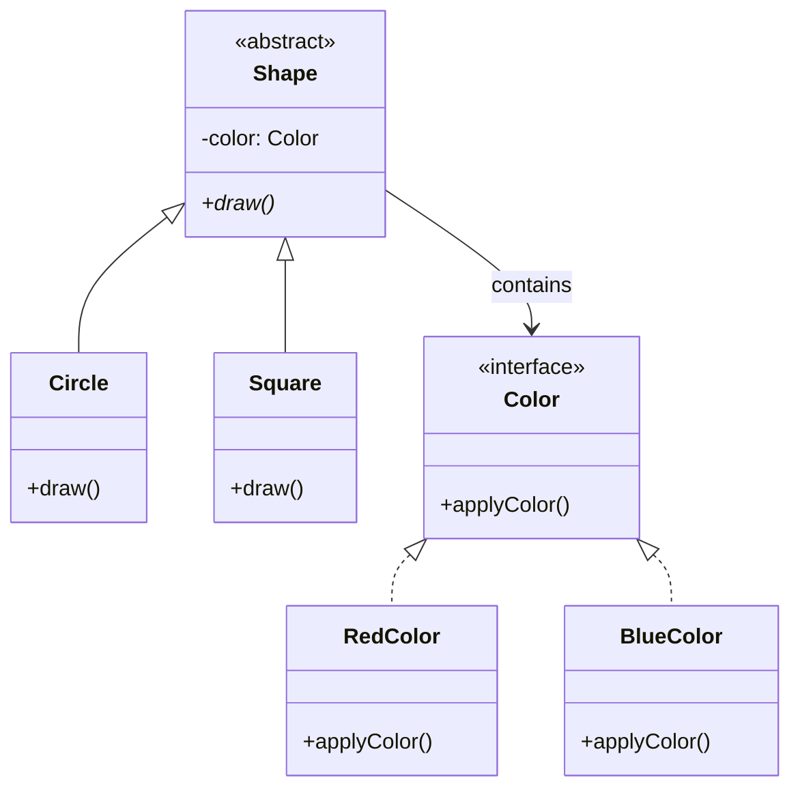

# Bridge Pattern (Mẫu Thiết Kế Cầu Nối)

**Bridge Pattern** là một mẫu thiết kế cấu trúc (Structural Pattern). Nó giúp tách biệt phần **Trừu tượng (Abstraction)** khỏi phần **Triển khai (Implementation)** của một đối tượng, cho phép cả hai phần này thay đổi và phát triển độc lập với nhau mà không làm ảnh hưởng đến nhau.

---

### 💡 Ví dụ đời thường dễ hiểu

- **Bối cảnh:** Bạn có một chiếc **Điều khiển từ xa (Remote Control)** và một chiếc **Tivi (TV)**.
- **Vấn đề:** 
  - Nếu mỗi loại Tivi (Sony, Samsung, LG) lại cần một chiếc điều khiển được thiết kế riêng cứng nhắc (SonyRemote chỉ điều khiển SonyTV, LGRemote chỉ điều khiển LGTV). Khi Sony ra mắt một mẫu Tivi mới, họ lại phải sản xuất một chiếc điều khiển mới. Điều này làm số lượng lớp điều khiển tăng vọt và gắn kết quá chặt chẽ.
- **Giải pháp (Bridge):**
  - Tách biệt **Bộ điều khiển (Abstraction - Điều khiển từ xa)** khỏi **Thiết bị (Implementation - Tivi)**.
  - Chiếc điều khiển chỉ cần định nghĩa các chức năng cơ bản (Bật/Tắt, Tăng/Giảm âm lượng, Chuyển kênh).
  - Tivi định nghĩa một giao diện chung để nhận các tín hiệu điều khiển đó.
  - Bạn có thể dùng một chiếc **Điều khiển đa năng (Universal Remote)**. Bằng cách kết nối (Bridge) chiếc điều khiển này với bất kỳ chiếc Tivi nào (Sony, Samsung), bạn đều có thể điều khiển được. Cả điều khiển và Tivi đều có thể nâng cấp độc lập (Remote có thể thêm phím cảm ứng, Tivi có thể nâng cấp tấm nền màn hình) mà không phá vỡ liên kết giữa chúng.

---

## 1. Vấn đề thực tế

Giả sử bạn có một lớp `Shape` (Hình học) với hai lớp con: `Circle` (Hình tròn) và `Square` (Hình vuông). Bạn muốn tích hợp thêm yếu tố màu sắc vào các hình này, ví dụ: màu Đỏ (`Red`) và Xanh (`Blue`).

Nếu sử dụng kế thừa thông thường, bạn sẽ phải tạo ra 4 lớp con kết hợp:
- `RedCircle`
- `BlueCircle`
- `RedSquare`
- `BlueSquare`

```
          [Shape]
         /       \
     [Circle]    [Square]
     /      \     /     \
[RedCircle] ... [RedSquare] ...
```

Nếu bạn thêm một hình mới là `Triangle` (Hình tam giác) hoặc màu mới là `Green` (Xanh lá), số lượng lớp con sẽ tăng theo cấp số nhân (Combinatorial Explosion). Với $M$ hình dạng và $N$ màu sắc, bạn sẽ cần $M \times N$ lớp con!

---

## 2. Giải pháp của Bridge Pattern

Bridge Pattern giải quyết vấn đề này bằng cách chuyển đổi từ mối quan hệ **Kế thừa (Is-a)** sang mối quan hệ **Chứa trong/Kết hợp (Has-a)**.

Chúng ta tách thuộc tính màu sắc thành một phân cấp lớp riêng biệt (gọi là **Implementation**). Lớp `Shape` (gọi là **Abstraction**) sẽ giữ một tham chiếu đến một đối tượng `Color` và ủy quyền các công việc liên quan đến màu sắc cho đối tượng đó.



Bây giờ, nếu muốn thêm hình mới hay màu mới, bạn chỉ cần tạo thêm lớp cho phân cấp tương ứng:
- Số lượng lớp cần tạo chỉ là $M + N$ thay vì $M \times N$.
- Thêm `Triangle` chỉ cần tạo lớp `Triangle` kế thừa `Shape`.
- Thêm màu `Green` chỉ cần tạo lớp `GreenColor` thực thi `Color`.

---

## 3. Các thành phần trong Bridge Pattern

1. **Abstraction (Trừu tượng):** Định nghĩa giao diện ở mức cao mà Client sử dụng. Nó duy trì một tham chiếu đến đối tượng thuộc kiểu `Implementor`.
2. **Refined Abstraction (Trừu tượng mở rộng):** Các lớp con mở rộng từ `Abstraction` (ví dụ: `AdvancedRemote`, `UrgentMessage`).
3. **Implementor (Triển khai):** Định nghĩa giao diện cho các lớp thực thi chi tiết. Giao diện này không nhất thiết phải giống giao diện của `Abstraction`. Thông thường, `Implementor` cung cấp các thao tác cơ bản, trong khi `Abstraction` định nghĩa các thao tác cấp cao dựa trên các thao tác cơ bản này.
4. **Concrete Implementors (Triển khai cụ thể):** Các lớp thực thi trực tiếp giao diện `Implementor` (ví dụ: `SonyTV`, `SmsSender`).

---

## 4. Triển khai bằng TypeScript

Dưới đây là ví dụ về hệ thống gửi tin nhắn thông qua các kênh truyền tải khác nhau:

```typescript
// Step 1: Định nghĩa Implementor (Kênh truyền tải tin nhắn)
interface MessageSender {
  sendRaw(text: string): void;
}

// Step 2: Triển khai các Concrete Implementors
class EmailSender implements MessageSender {
  public sendRaw(text: string): void {
    console.log(`✉️ Gửi Email: ${text}`);
  }
}

class SmsSender implements MessageSender {
  public sendRaw(text: string): void {
    console.log(`📱 Gửi SMS: ${text}`);
  }
}

// Step 3: Định nghĩa Abstraction (Loại tin nhắn)
abstract class Message {
  protected sender: MessageSender; // Cầu nối (Bridge)

  constructor(sender: MessageSender) {
    this.sender = sender;
  }

  public abstract send(content: string): void;
}

// Step 4: Định nghĩa Refined Abstractions (Loại tin nhắn cụ thể)
class NormalMessage extends Message {
  public send(content: string): void {
    this.sender.sendRaw(content);
  }
}

class UrgentMessage extends Message {
  public send(content: string): void {
    const urgentContent = `🔥 [KHẨN CẤP] ${content}`;
    this.sender.sendRaw(urgentContent);
  }
}
```

### Cách sử dụng ở Client:

```typescript
// Gửi tin nhắn thường qua Email
const emailSender = new EmailNotificationSender();
const normalEmail = new NormalMessage(emailSender);
normalEmail.send("Hệ thống hoạt động bình thường."); 
// Output: ✉️ Gửi Email: Hệ thống hoạt động bình thường.

// Gửi tin nhắn khẩn cấp qua SMS
const smsSender = new SmsSender();
const urgentSms = new UrgentMessage(smsSender);
urgentSms.send("Máy chủ quá tải 99% CPU!"); 
// Output: 📱 Gửi SMS: 🔥 [KHẨN CẤP] Máy chủ quá tải 99% CPU!
```

---

## 5. Ưu điểm và Nhược điểm

### 👍 Ưu điểm:
- **Tách biệt code:** Giúp tách biệt mã nguồn nghiệp vụ cấp cao khỏi các chi tiết kỹ thuật triển khai cấp thấp.
- **Dễ dàng mở rộng:** Thêm các Abstraction mới hoặc Implementor mới mà không làm ảnh hưởng đến phần còn lại.
- **Ẩn giấu chi tiết kỹ thuật:** Client hoàn toàn không biết về cách thức hoạt động thực tế bên dưới của phần Implementor.
- **Giảm số lượng class con:** Tránh hiện tượng bùng nổ số lượng lớp kế thừa.

### 👎 Nhược điểm:
- **Làm code phức tạp hơn:** Việc chia nhỏ đối tượng thành Abstraction và Implementation đòi hỏi tư duy thiết kế cao hơn và làm tăng số lượng class/interface ban đầu trong các hệ thống đơn giản.

---

## 🏁 Học thực hành tiếp theo

Hãy mở file **[index.ts](file:///Users/mapclient.001/Desktop/Work/Learning/BE/design-patterns/07-S-Bridge-pattern/index.ts)** để khám phá ví dụ đầy đủ về hệ thống điều khiển từ xa và các thiết bị điện tử chạy trực tiếp nhé!
