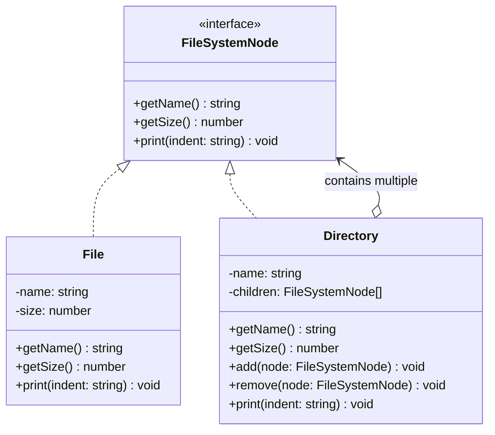

# Composite Pattern (Mẫu Thiết Kế Tổ Hợp)

**Composite Pattern** là một mẫu thiết kế cấu trúc (Structural Pattern). Nó cho phép bạn tổ chức các đối tượng theo cấu trúc dạng cây để biểu diễn các phân cấp "một phần - toàn bộ" (part-whole hierarchies). Mẫu thiết kế này cho phép khách hàng (client) xử lý các đối tượng đơn lẻ và các nhóm đối tượng (tổ hợp) một cách thống nhất, như nhau.

---

### 💡 Ví dụ đời thường dễ hiểu

- **Bối cảnh:** Bạn có một chiếc **Hộp quà lớn**.
- **Vấn đề:** 
  - Chiếc hộp quà này có thể chứa các món quà đơn lẻ như một cái **Cờ-lê**, một cái **Búa**.
  - Nó cũng có thể chứa các **Hộp quà nhỏ hơn**, bên trong hộp quà nhỏ lại chứa một chiếc **Điện thoại** và một hộp quà siêu nhỏ chứa **Tai nghe**.
  - Nếu bạn muốn tính tổng giá tiền của tất cả các món đồ bên trong hộp lớn, bạn sẽ phải mở từng hộp, kiểm tra xem bên trong là sản phẩm hay hộp khác để cộng dồn. Logic sẽ rất phức tạp nếu không có cấu trúc thống nhất.
- **Giải pháp (Composite):**
  - Định nghĩa một giao diện chung gọi là `Thiết bị/Vật phẩm` có phương thức `tinhGiaTien()`.
  - Một **Sản phẩm đơn lẻ** (như Điện thoại, Búa) sẽ thực hiện phương thức này bằng cách trả về giá tiền của chính nó.
  - Một **Hộp quà** (tổ hợp) chứa danh sách các `Vật phẩm`. Khi gọi `tinhGiaTien()`, nó sẽ duyệt qua toàn bộ danh sách vật phẩm con bên trong, gọi phương thức `tinhGiaTien()` của từng con và cộng dồn lại.
  - Client chỉ cần cầm chiếc hộp lớn nhất và gọi `tinhGiaTien()` mà không cần quan tâm cấu trúc phân cấp bên trong phức tạp thế nào.

---

## 1. Vấn đề thực tế

Giả sử bạn đang xây dựng một hệ thống Quản lý tệp tin (File System). Bạn có hai thực thể chính: `File` (Tệp tin) và `Directory` (Thư mục). 
- Một `File` chỉ là một tệp đơn giản có dung lượng (size).
- Một `Directory` có thể chứa cả `File` và các `Directory` con khác.

Nếu bạn muốn tính tổng dung lượng của một thư mục, bạn phải viết một hàm kiểm tra kiểu dữ liệu:
- Nếu là `File`, lấy dung lượng trực tiếp.
- Nếu là `Directory`, lặp qua các phần tử con, đệ quy tiếp tục.

Điều này làm cho mã nguồn của Client bị gắn chặt với các lớp cụ thể, khó mở rộng (ví dụ khi thêm loại tệp tin liên kết, tệp tin ảo).

---

## 2. Giải pháp của Composite Pattern

Composite Pattern đề xuất việc sử dụng một giao diện chung (Component) cho cả đối tượng đơn giản (Leaf) và đối tượng phức tạp (Composite).

Bằng cách này, client có thể đối xử với một `File` hay một `Directory` hoàn toàn giống nhau thông qua giao diện `FileSystemNode`.

---

## 3. Các thành phần trong Composite Pattern

1. **Component (Thành phần):** Định nghĩa giao diện chung cho tất cả các đối tượng trong cây (cả lá và nhánh). Nó khai báo các thao tác chung (ví dụ: `getSize()`, `print()`).
2. **Leaf (Lá):** Đại diện cho các đối tượng lá không có con. Lớp này thực thi trực tiếp các hành vi cốt lõi của Component.
3. **Composite (Tổ hợp/Nhánh):** Đại diện cho các đối tượng có chứa các con (có thể là Lá hoặc Tổ hợp khác). Lớp này chứa danh sách các thành phần con và triển khai các phương thức thêm/xóa con, đồng thời thực hiện các thao tác của Component bằng cách ủy quyền và gom nhóm kết quả từ các con.
4. **Client (Khách hàng):** Thao tác với các phần tử trong cây thông qua giao diện Component.

---

## 4. Triển khai bằng TypeScript

Hãy tham khảo file **[index.ts](file:///Users/thantran/Desktop/learn/design-pattern/08-S-Composite-pattern/index.ts)** để xem ví dụ đầy đủ và chi tiết về cấu trúc File System chạy trực tiếp.

---

## 5. Ưu điểm và Nhược điểm

### 👍 Ưu điểm:
- **Tính đa hình thống nhất:** Client có thể làm việc với cấu trúc cây phức tạp mà không cần quan tâm đối tượng đang xử lý là lá hay nhánh.
- **Dễ dàng mở rộng:** Dễ dàng thêm các loại Leaf hoặc Composite mới vào hệ thống mà không làm ảnh hưởng đến mã nguồn Client hiện tại (Open/Closed Principle).

### 👎 Nhược điểm:
- **Khó giới hạn thành phần của Composite:** Đôi khi bạn muốn một thư mục chỉ chứa file ảnh chứ không chứa thư mục khác, nhưng vì giao diện chung thống nhất, việc ép buộc kiểm tra kiểu dữ liệu lúc runtime sẽ phức tạp và làm suy yếu tính nhất quán của mẫu thiết kế.

---

## 🏁 Học thực hành tiếp theo

Hãy mở file **[index.ts](file:///Users/thantran/Desktop/learn/design-pattern/08-S-Composite-pattern/index.ts)** để xem ví dụ chạy thử nghiệm, sau đó đọc đề bài ở **[EXERCISES.md](file:///Users/thantran/Desktop/learn/design-pattern/08-S-Composite-pattern/EXERCISES.md)** và thực hành code trong **[exercises.ts](file:///Users/thantran/Desktop/learn/design-pattern/08-S-Composite-pattern/exercises.ts)**!
