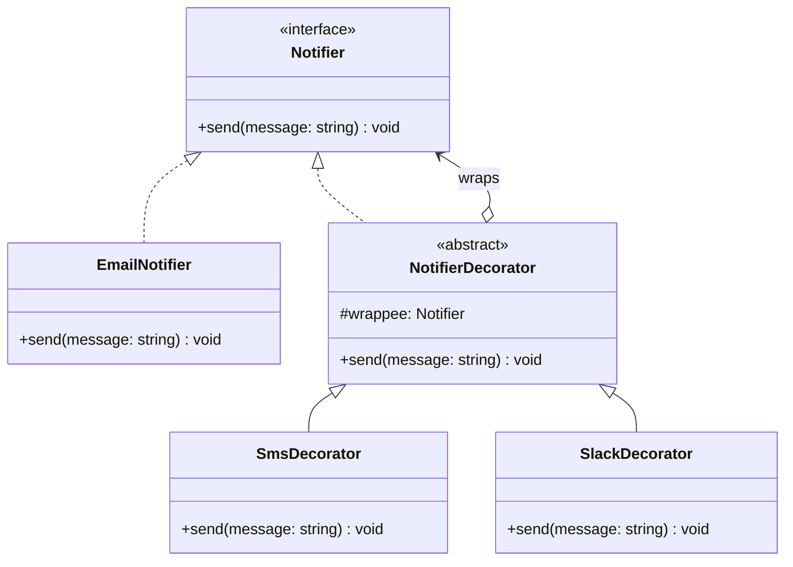

# Decorator Pattern (Mẫu Thiết Kế Trang Trí)

**Decorator Pattern** là một mẫu thiết kế cấu trúc (Structural Pattern). Nó cho phép bạn đính kèm các hành vi hoặc chức năng mới vào một đối tượng một cách động (ngay lúc runtime) bằng cách đặt đối tượng đó bên trong các đối tượng bao bọc (wrapper) đặc biệt chứa các hành vi đó, mà không làm ảnh hưởng đến các đối tượng khác cùng lớp.

---

### 💡 Ví dụ đời thường dễ hiểu

- **Bối cảnh:** Bạn mua một ly **Cà phê đen** nguyên chất.
- **Vấn đề:**
  - Bạn muốn ly cà phê của mình có thêm **Sữa** (`Milk`), thêm **Đường** (`Sugar`), và thêm một lớp **Kem** (`Whip`) phủ lên trên.
  - Nếu sử dụng kế thừa, bạn sẽ phải tạo ra vô số lớp con như: `CoffeeWithMilk`, `CoffeeWithSugar`, `CoffeeWithMilkAndSugar`, `CoffeeWithMilkSugarAndWhip`... Số lượng lớp sẽ bùng nổ rất nhanh khi số lượng topping tăng lên.
- **Giải pháp (Decorator):**
  - Hãy coi cốc **Cà phê đen** là thành phần cơ bản.
  - Mỗi loại topping (Sữa, Đường, Kem) sẽ là một chiếc "áo khoác" (Decorator) bao bọc lấy ly cà phê.
  - Cả ly cà phê gốc và các loại topping đều có chung một giao diện (ví dụ: có phương thức `tinhTien()` và `layMoTa()`).
  - Khi bạn gọi `tinhTien()` ở lớp ngoài cùng (ví dụ: Kem bao ngoài Sữa, Sữa bao ngoài Cà phê đen), nó sẽ lấy giá của lớp Kem cộng với kết quả tính tiền của lớp Sữa, lớp Sữa lại cộng với giá của Cà phê đen.
  - Bạn có thể tùy ý mix các loại topping bất kỳ lúc nào ngay khi chương trình đang chạy.

---

## 1. Vấn đề thực tế

Giả sử bạn đang xây dựng một thư viện gửi Thông báo (`Notifier`).
Lớp cơ bản ban đầu là `EmailNotifier` có phương thức `send(message)`.

Sau đó, khách hàng muốn gửi thông báo qua cả **SMS**, qua **Slack** và qua **Facebook**.
Nếu dùng kế thừa, bạn phải thiết lập:
- `SmsNotifier`
- `SlackNotifier`
- `EmailAndSmsNotifier`
- `EmailAndSlackNotifier`
- `SmsAndSlackNotifier`
- `AllInOneNotifier`

Số lượng lớp con kết hợp sẽ tăng lên theo cấp số nhân và dẫn đến mã nguồn trùng lặp lớn.

---

## 2. Giải pháp của Decorator Pattern

Decorator Pattern đề xuất thay thế việc kế thừa (Inheritance) bằng cơ chế **Kết hợp (Composition)** hoặc **Chứa trong (Aggregation)**. 

Bạn tạo một lớp Decorator chung triển khai cùng giao diện với đối tượng đích, và giữ một tham chiếu đến đối tượng đích đó.

---

## 3. Các thành phần trong Decorator Pattern

1. **Component (Thành phần):** Giao diện chung cho cả đối tượng được bao bọc (wrapper) và đối tượng bao bọc (decorators).
2. **Concrete Component (Thành phần cụ thể):** Đối tượng cơ bản cần được thêm hành vi (ví dụ: `EmailNotifier`, `SimpleCoffee`).
3. **Base Decorator (Trang trí cơ bản):** Một lớp trừu tượng thực thi giao diện `Component`, chứa một trường tham chiếu đến một đối tượng `Component` khác và ủy quyền toàn bộ công việc cho đối tượng đó.
4. **Concrete Decorators (Trang trí cụ thể):** Các lớp con kế thừa từ `Base Decorator`, ghi đè các phương thức để thêm hành vi mới trước hoặc sau khi gọi phương thức của đối tượng được bao bọc.

---

## 4. Triển khai bằng TypeScript

Hãy tham khảo file **[index.ts](file:///Users/thantran/Desktop/learn/design-pattern/09-S-Decorator-pattern/index.ts)** để xem ví dụ đầy đủ và chi tiết về cấu trúc pha chế Cà phê (Coffee shop) chạy trực tiếp.

---

## 5. Ưu điểm và Nhược điểm

### 👍 Ưu điểm:
- **Linh hoạt cao:** Có thể thêm hoặc bớt hành vi của một đối tượng ngay khi chương trình đang chạy.
- **Tuân thủ Nguyên lý đơn nhiệm (Single Responsibility Principle):** Có thể chia nhỏ một lớp chứa nhiều hành vi thành nhiều lớp Decorator đơn giản hơn.
- **Tránh bùng nổ class:** Giảm thiểu số lượng lớp con so với việc dùng kế thừa.

### 👎 Nhược điểm:
- **Khó khăn khi gỡ bỏ Decorator:** Rất khó để gỡ bỏ một lớp decorator cụ thể nằm sâu trong chuỗi bao bọc (wrapper stack).
- **Code nhiều file nhỏ:** Hệ thống sẽ sinh ra rất nhiều lớp nhỏ hoạt động giống nhau, gây khó khăn cho việc debug và đọc hiểu cấu trúc ban đầu.

---

## 🏁 Học thực hành tiếp theo

Hãy mở file **[index.ts](file:///Users/thantran/Desktop/learn/design-pattern/09-S-Decorator-pattern/index.ts)** để xem ví dụ chạy thử nghiệm, sau đó đọc đề bài ở **[EXERCISES.md](file:///Users/thantran/Desktop/learn/design-pattern/09-S-Decorator-pattern/EXERCISES.md)** và thực hành code trong **[exercises.ts](file:///Users/thantran/Desktop/learn/design-pattern/09-S-Decorator-pattern/exercises.ts)**!
