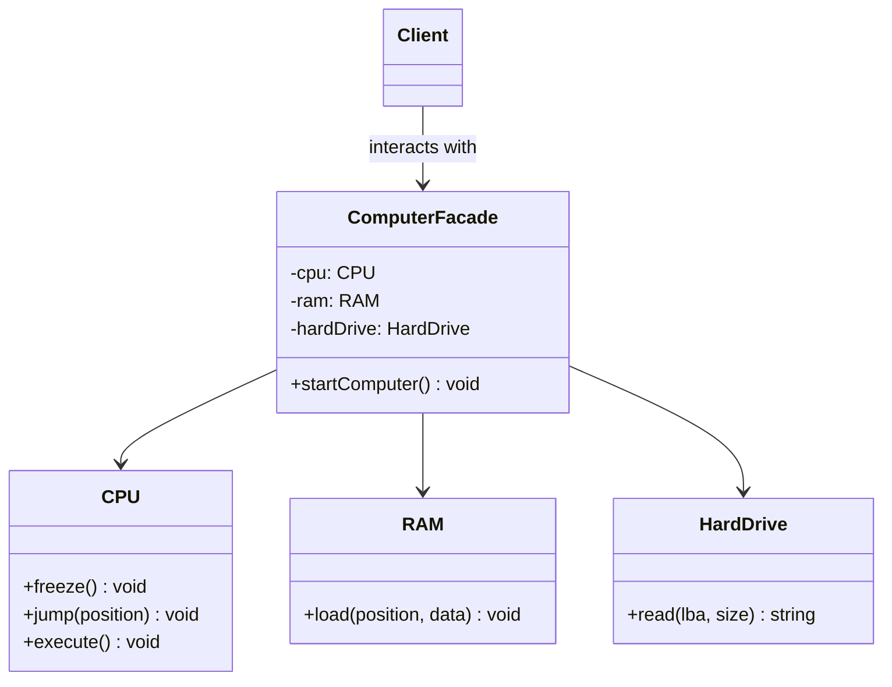

# Facade Pattern (Mẫu Thiết Kế Mặt Tiền)

**Facade Pattern** là một mẫu thiết kế cấu trúc (Structural Pattern). Nó cung cấp một giao diện đơn giản hóa, thống nhất (gọi là "Mặt tiền") cho một hệ thống con (subsystem) phức tạp gồm nhiều lớp, thư viện, hoặc framework. Khách hàng (client) chỉ cần tương tác qua Facade này thay vì phải gọi và quản lý từng lớp con riêng lẻ.

---

### 💡 Ví dụ đời thường dễ hiểu

- **Bối cảnh:** Bạn muốn lắp ráp và xem một bộ phim bằng hệ thống **Rạp chiếu phim tại nhà (Home Theater System)**.
- **Vấn đề:**
  - Để xem phim, bạn phải thực hiện các bước sau:
    1. Bật máy làm bắp rang bơ, bắt đầu nổ bắp.
    2. Hạ rèm chiếu xuống.
    3. Bật máy chiếu, chuyển sang chế độ màn ảnh rộng.
    4. Bật âm ly (Amplifier), chỉnh âm lượng lên mức 7.
    5. Bật đầu đĩa DVD, nhấn nút Play.
  - Mỗi khi kết thúc phim, bạn lại phải làm ngược lại các bước đó để tắt. Việc này rất phiền phức, dễ sót bước, và đòi hỏi client phải biết cách sử dụng mọi thiết bị.
- **Giải pháp (Facade):**
  - Tạo một lớp gọi là **HomeTheaterFacade** đại diện cho "Mặt tiền" điều khiển.
  - Lớp này cung cấp 2 phương thức cực kỳ đơn giản: `watchMovie("Avenger")` và `endMovie()`.
  - Bên trong `watchMovie()`, Facade sẽ tự động gọi tất cả các phương thức khởi động của các thiết bị con theo đúng trình tự.
  - Bạn chỉ cần bấm duy nhất một nút bấm ảo từ chiếc Facade này, toàn bộ hệ thống con phức tạp bên dưới sẽ tự động vận hành trơn tru.

---

## 1. Vấn đề thực tế

Khi xây dựng một ứng dụng, mã nguồn của bạn thường phải phụ thuộc vào rất nhiều đối tượng của các thư viện hoặc hệ thống con bên ngoài.

Ví dụ, để xử lý việc chuyển đổi định dạng Video, bạn cần làm việc với:
- `VideoFile` (đọc file)
- `CodecFactory` (nhận diện giải mã)
- `BitrateReader` (đọc tốc độ bit)
- `AudioMixer` (trộn âm thanh)

Mã nguồn client sẽ cực kỳ phức tạp và bị gắn chặt (tightly coupled) với cấu trúc bên trong của thư viện chuyển đổi video đó. Nếu thư viện thay đổi API, toàn bộ code client của bạn sẽ bị vỡ.

---

## 2. Giải pháp của Facade Pattern

Facade cung cấp một cổng giao tiếp duy nhất và đơn giản hóa để làm việc với thư viện. Nó không làm mất đi các tính năng nâng cao của thư viện, nhưng ẩn giấu chúng đi để client sử dụng dễ dàng hơn.

---

## 3. Các thành phần trong Facade Pattern

1. **Facade (Mặt tiền):** Cung cấp các phương thức tiện ích cấp cao để truy cập vào các chức năng cụ thể của các hệ thống con. Nó hiểu rõ hệ thống con nào sẽ chịu trách nhiệm xử lý yêu cầu nào của client.
2. **Subsystems (Hệ thống con):** Gồm nhiều lớp xử lý các logic nghiệp vụ phức tạp khác nhau. Chúng hoàn toàn độc lập và không biết đến sự hiện diện của Facade.
3. **Client (Khách hàng):** Gọi các phương thức từ Facade thay vì trực tiếp thao tác với các Subsystems phức tạp.

---

## 4. Triển khai bằng TypeScript

Hãy tham khảo file **[index.ts](file:///Users/thantran/Desktop/learn/design-pattern/10-S-Facade-pattern/index.ts)** để xem ví dụ đầy đủ và chi tiết về bộ điều khiển Rạp chiếu phim tại nhà chạy trực tiếp.

---

## 5. Ưu điểm và Nhược điểm

### 👍 Ưu điểm:
- **Giảm sự gắn kết (Loose Coupling):** Giúp cô lập mã nguồn của bạn khỏi sự phức tạp của thư viện bên thứ ba.
- **Dễ sử dụng:** Cung cấp giao diện đơn giản, thân thiện hơn cho nhà phát triển.
- **Dễ bảo trì:** Khi các hệ thống con bên dưới thay đổi cấu trúc, bạn chỉ cần sửa đổi mã nguồn ở Facade, Client hoàn toàn không bị ảnh hưởng.

### 👎 Nhược điểm:
- **Nguy cơ tạo ra God Object:** Lớp Facade có thể phình to quá mức, trở thành một lớp "biết tuốt" và làm mọi thứ trong hệ thống, vi phạm nguyên lý Single Responsibility.

---

## 🏁 Học thực hành tiếp theo

Hãy mở file **[index.ts](file:///Users/thantran/Desktop/learn/design-pattern/10-S-Facade-pattern/index.ts)** để xem ví dụ chạy thử nghiệm, sau đó đọc đề bài ở **[EXERCISES.md](file:///Users/thantran/Desktop/learn/design-pattern/10-S-Facade-pattern/EXERCISES.md)** và thực hành code trong **[exercises.ts](file:///Users/thantran/Desktop/learn/design-pattern/10-S-Facade-pattern/exercises.ts)**!
