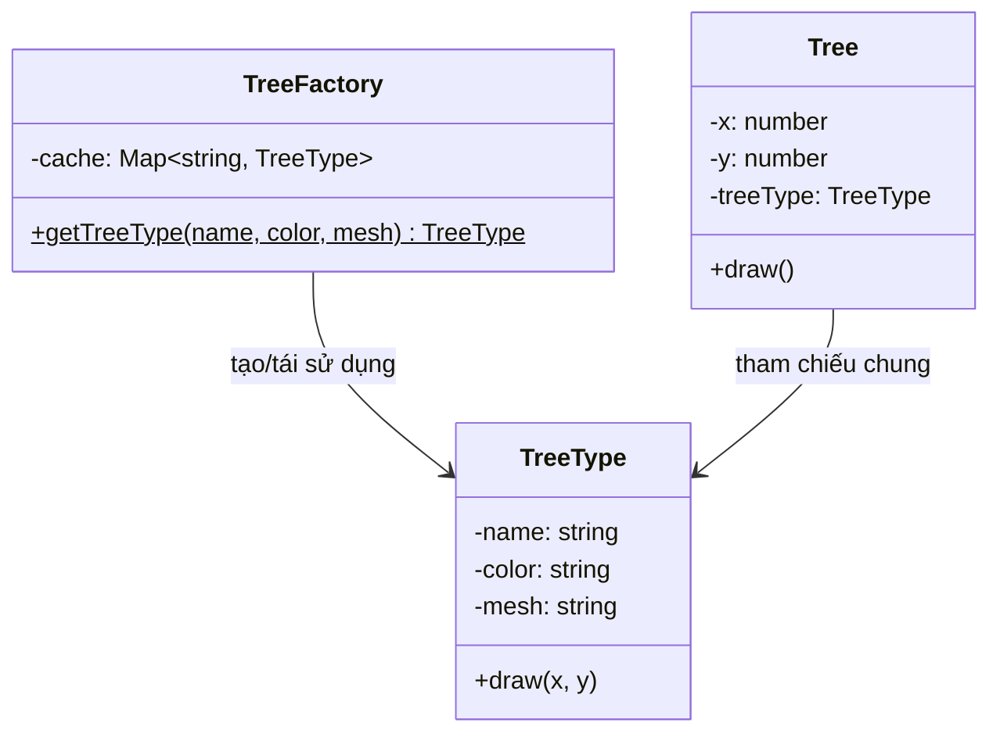

# Flyweight Pattern (Structural Pattern)

## Khái niệm
**Flyweight Pattern** (Mẫu Thiết kế Tối giản) là một mẫu thiết kế cấu trúc giúp bạn **tiết kiệm bộ nhớ** bằng cách chia sẻ trạng thái chung giữa nhiều đối tượng thay vì giữ tất cả dữ liệu trong mỗi đối tượng riêng lẻ.

Nó đặc biệt hữu ích khi ứng dụng cần tạo ra một lượng cực kỳ lớn các đối tượng tương tự nhau (ví dụ: hàng triệu cây trong game, hàng ngàn ký tự trên một trang văn bản), khiến bộ nhớ RAM bị quá tải.

---

## Vấn đề đặt ra
Hãy tưởng tượng bạn đang viết một trò chơi điện tử thể loại sinh tồn trong rừng. Bản đồ có hàng triệu cây xanh. Mỗi cây cần lưu các thông tin:
- Tọa độ `x`, `y` (2 số float).
- Hình dạng 3D (`mesh`), Texture hình ảnh (dung lượng lớn, vài MB).
- Màu sắc lá cây.

Nếu tạo ra 1,000,000 đối tượng `Tree` độc lập, lượng bộ nhớ RAM tiêu tốn sẽ là khổng lồ (vài GB) chỉ để hiển thị cây cối, dẫn đến việc game bị crash do tràn bộ nhớ.

## Giải pháp của Flyweight
Flyweight khuyên chúng ta tách các thuộc tính của một đối tượng thành hai phần:

1. **Intrinsic State (Trạng thái nội tại):**
   - Là những thông tin mang tính chất **hằng số**, giống nhau giữa các đối tượng và **không thay đổi** theo ngữ cảnh.
   - *Ví dụ:* Hình dạng 3D (`mesh`), Texture hình ảnh của cây sồi. Tất cả cây sồi đều có chung những dữ liệu đồ họa này.
   - Phần trạng thái này sẽ được tách ra thành một đối tượng riêng gọi là **Flyweight** và được chia sẻ dùng chung cho tất cả các cây cùng loại.

2. **Extrinsic State (Trạng thái ngoại tại):**
   - Là những thông tin **thay đổi phụ thuộc vào ngữ cảnh** bên ngoài.
   - *Ví dụ:* Tọa độ vị trí (`x`, `y`), độ lớn (scale), lượng máu còn lại của từng cây cụ thể.
   - Phần trạng thái này được lưu ở đối tượng ngữ cảnh chứa Flyweight hoặc được truyền vào phương thức của Flyweight khi cần xử lý.

---

## Cấu trúc của Flyweight Pattern

1. **Flyweight (ví dụ: `TreeType`):** Chứa phần trạng thái nội tại (Intrinsic State). Đối tượng này phải không thể thay đổi dữ liệu sau khi khởi tạo (immutable).
2. **Flyweight Factory (ví dụ: `TreeFactory`):** Quản lý và tái sử dụng các đối tượng Flyweight. Khi Client yêu cầu một Flyweight, Factory kiểm tra xem nó đã tồn tại chưa. Nếu có rồi thì trả về đối tượng hiện tại, nếu chưa thì tạo mới và lưu lại.
3. **Context (ví dụ: `Tree`):** Chứa trạng thái ngoại tại (Extrinsic State) và tham chiếu tới đối tượng Flyweight tương ứng.
4. **Client:** Sử dụng Factory để tạo các đối tượng và truyền trạng thái ngoại tại vào chúng.

---

## Sơ đồ cấu trúc



---

## Ví dụ Minh Họa (TypeScript)

Xem mã nguồn chi tiết tại [index.ts](file:///Users/mapclient.001/Desktop/Work/Learning/BE/design-patterns/11-S-Flyweight-pattern/index.ts).

```typescript
// 1. Flyweight class: Chứa Intrinsic State (dữ liệu nặng, dùng chung)
class TreeType {
  private name: string;
  private color: string;
  private texture: string; // Giả lập dữ liệu hình ảnh nặng

  constructor(name: string, color: string, texture: string) {
    this.name = name;
    this.color = color;
    this.texture = texture;
  }

  // Phương thức thực thi nhận Extrinsic State (x, y) từ bên ngoài
  public draw(x: number, y: number): void {
    console.log(`Vẽ cây [${this.name}] màu [${this.color}] tại tọa độ (${x}, ${y})`);
  }
}

// 2. Flyweight Factory: Đảm bảo tái sử dụng Flyweight
class TreeFactory {
  private static treeTypes: Map<string, TreeType> = new Map();

  public static getTreeType(name: string, color: string, texture: string): TreeType {
    const key = `${name}_${color}`;
    if (!this.treeTypes.has(key)) {
      console.log(`[Factory] Tạo mới TreeType: ${key}`);
      this.treeTypes.set(key, new TreeType(name, color, texture));
    }
    return this.treeTypes.get(key)!;
  }

  public static getCount(): number {
    return this.treeTypes.size;
  }
}

// 3. Context class: Chứa Extrinsic State (tọa độ riêng lẻ) và tham chiếu Flyweight
class Tree {
  private x: number;
  private y: number;
  private type: TreeType; // Tham chiếu đến Flyweight

  constructor(x: number, y: number, type: TreeType) {
    this.x = x;
    this.y = y;
    this.type = type;
  }

  public draw(): void {
    this.type.draw(this.x, this.y);
  }
}
```

---

## Ưu điểm và Nhược điểm

### Ưu điểm
- **Tiết kiệm bộ nhớ cực lớn** nếu ứng dụng sử dụng rất nhiều đối tượng tương tự nhau.
- Tăng hiệu suất ứng dụng bằng cách giảm tần suất dọn dẹp bộ nhớ (Garbage Collection).

### Nhược điểm
- **Làm phức tạp thêm mã nguồn**: Cần chia nhỏ các thuộc tính thành Intrinsic/Extrinsic.
- **Tốn CPU hơn một chút**: Mỗi lần gọi phương thức của Flyweight, ta phải truyền các tham số ngoại tại vào.
