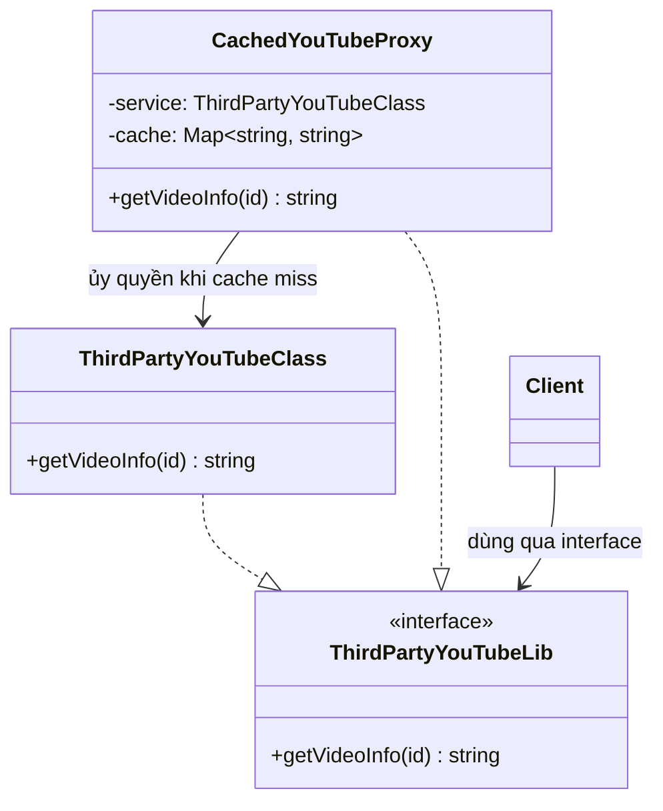

# Proxy Pattern (Structural Pattern)

## Khái niệm
**Proxy Pattern** (Mẫu Thiết kế Ủy quyền / Đại diện) là một mẫu thiết kế cấu trúc cho phép bạn cung cấp một đối tượng thay thế hoặc đại diện cho một đối tượng khác. 

Một Proxy kiểm soát quyền truy cập đến đối tượng gốc (Real Subject), cho phép bạn thực hiện một số công việc trước hoặc sau khi yêu cầu được chuyển đến đối tượng gốc (ví dụ: kiểm tra quyền, lazy loading, caching, logging).

---

## Các loại Proxy phổ biến

1. **Virtual Proxy (Proxy ảo):**
   - Trì hoãn việc khởi tạo đối tượng gốc vốn tiêu tốn nhiều tài nguyên (lazy loading) cho đến khi thực sự cần thiết.
   - *Ví dụ:* Tải một hình ảnh dung lượng lớn từ đĩa cứng hoặc mạng chỉ khi hình ảnh đó được cuộn tới trên màn hình.

2. **Protection Proxy (Proxy bảo vệ):**
   - Kiểm soát quyền truy cập vào đối tượng gốc dựa trên các tiêu chí bảo mật (Access Control / Authorization).
   - *Ví dụ:* Chỉ cho phép người dùng có vai trò `ADMIN` thực hiện các truy vấn ghi dữ liệu hoặc xóa bản ghi trong Database.

3. **Caching Proxy (Proxy lưu đệm):**
   - Lưu trữ kết quả của các thao tác tốn kém và trả về kết quả lưu trong bộ nhớ đệm cho các yêu cầu giống nhau tiếp theo mà không cần gọi lại đối tượng gốc.
   - *Ví dụ:* Proxy gọi API bên thứ ba, lưu trữ phản hồi trong vòng 5 phút để tránh gọi API liên tục gây tốn phí hoặc bị giới hạn rate limit.

---

## Cấu trúc của Proxy Pattern

1. **Subject Interface:** Định nghĩa interface chung cho cả Real Subject và Proxy, giúp Proxy có thể thay thế hoàn toàn Real Subject mà Client không cần nhận biết sự khác biệt.
2. **Real Subject:** Đối tượng thực sự chứa logic nghiệp vụ cốt lõi (nhưng có thể nặng, cần bảo mật hoặc chạy chậm).
3. **Proxy:** Đại diện cho Real Subject, chứa tham chiếu tới Real Subject. Nó triển khai Subject Interface để đón nhận các yêu cầu từ Client, xử lý logic bổ sung (phân quyền, cache, lazy load) trước hoặc sau khi chuyển tiếp yêu cầu đến Real Subject.
4. **Client:** Làm việc với Proxy thông qua Subject Interface.

---

## Sơ đồ cấu trúc



---

## Ví dụ Minh Họa (TypeScript)

Xem mã nguồn chi tiết tại [index.ts](file:///Users/mapclient.001/Desktop/Work/Learning/BE/design-patterns/12-S-Proxy-pattern/index.ts).

```typescript
// 1. Subject Interface
interface ThirdPartyYouTubeLib {
  getVideoInfo(id: string): string;
}

// 2. Real Subject: Thực hiện tải dữ liệu nặng từ Internet
class ThirdPartyYouTubeClass implements ThirdPartyYouTubeLib {
  public getVideoInfo(id: string): string {
    console.log(`🌐 [Real Service] Đang kết nối Internet và tải video: ${id}...`);
    return `Video Data [${id}]`;
  }
}

// 3. Caching Proxy: Tránh gọi Real Subject nhiều lần cho cùng một video
class CachedYouTubeProxy implements ThirdPartyYouTubeLib {
  private service: ThirdPartyYouTubeClass;
  private cache: Map<string, string> = new Map();

  constructor(service: ThirdPartyYouTubeClass) {
    this.service = service;
  }

  public getVideoInfo(id: string): string {
    if (!this.cache.has(id)) {
      console.log(`💾 [Proxy] Cache miss cho video ${id}. Gọi dịch vụ gốc...`);
      const data = this.service.getVideoInfo(id);
      this.cache.set(id, data);
    } else {
      console.log(`⚡ [Proxy] Cache hit cho video ${id}. Trả về từ bộ nhớ đệm.`);
    }
    return this.cache.get(id)!;
  }
}
```

---

## Ưu điểm và Nhược điểm

### Ưu điểm
- **Kiểm soát tốt hơn**: Bạn có thể quản lý vòng đời và quyền truy cập của đối tượng gốc mà Client không biết.
- **Tối ưu hóa hiệu năng**: Tránh tải các tài nguyên lớn khi chưa cần thiết (Virtual Proxy) hoặc giảm tải cho server qua bộ nhớ đệm (Caching Proxy).
- **Mở rộng linh hoạt**: Tuân thủ nguyên lý Single Responsibility (tách biệt logic nghiệp vụ gốc và logic quản trị/phụ trợ) và Open/Closed Principle (có thể tạo thêm proxy mới mà không sửa đổi đối tượng gốc).

### Nhược điểm
- **Tăng độ trễ**: Có thêm một lớp trung gian (Proxy) có thể làm chậm thời gian phản hồi một chút đối với các yêu cầu trực tiếp.
- **Mã nguồn phức tạp hơn**: Cần khai báo thêm nhiều interface và class trung gian.
