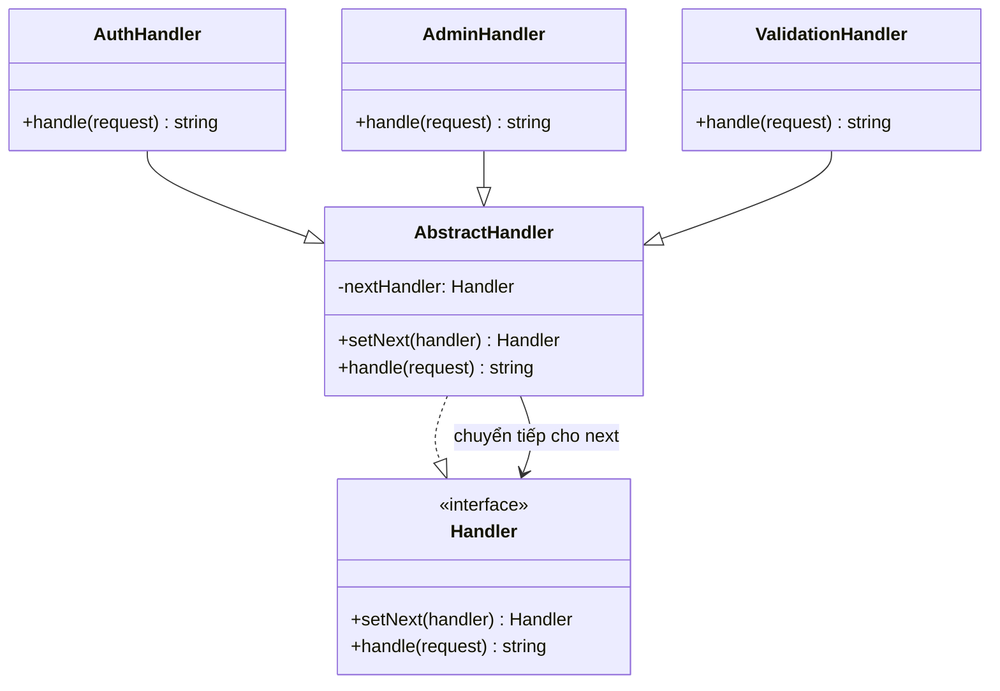

# Chain of Responsibility Pattern (Behavioral Pattern)

## Khái niệm
**Chain of Responsibility** (Chuỗi Trách nhiệm) là một mẫu thiết kế hành vi cho phép bạn truyền các yêu cầu dọc theo một chuỗi các trình xử lý (handlers). 

Khi nhận được yêu cầu, mỗi trình xử lý sẽ quyết định xử lý yêu cầu đó hoặc chuyển tiếp nó cho trình xử lý tiếp theo trong chuỗi.

---

## Vấn đề đặt ra
Hãy tưởng tượng bạn đang xây dựng một hệ thống đặt hàng trực tuyến. Bạn muốn giới hạn quyền truy cập vào hệ thống:
1. Đầu tiên, chỉ những yêu cầu đã đăng nhập (được xác thực) mới được xử lý.
2. Tiếp theo, chỉ những người dùng có quyền admin mới được phép truy cập trang quản trị.
3. Cuối cùng, dữ liệu đầu vào của yêu cầu phải được kiểm tra (validation) kỹ càng để tránh lỗ hổng bảo mật.

Nếu bạn viết tất cả code kiểm tra này vào một khối lệnh lớn trong Controller, code sẽ rất rối, khó bảo trì, khó tái sử dụng. Hơn nữa, nếu sau này bạn muốn thêm bước kiểm tra (ví dụ: kiểm tra spam request, logging, ghi cache), bạn sẽ phải sửa đổi trực tiếp Controller đó (vi phạm nguyên lý Open/Closed).

## Giải pháp của Chain of Responsibility
Mẫu thiết kế này khuyên bạn nên tách biệt từng bước xử lý thành các đối tượng độc lập gọi là **Handler**. Mỗi handler chứa một trường tham chiếu để trỏ tới handler tiếp theo trong chuỗi.

Khi một yêu cầu đi vào hệ thống:
1. Handler đầu tiên tiếp nhận yêu cầu.
2. Nó kiểm tra xem mình có thể xử lý yêu cầu này hay không.
3. Nếu xử lý xong và quyết định dừng lại, chuỗi kết thúc.
4. Nếu xử lý xong nhưng cần kiểm tra tiếp, hoặc không thuộc quyền xử lý của nó, nó chuyển yêu cầu cho handler tiếp theo thông qua liên kết tham chiếu.

---

## Cấu trúc của Chain of Responsibility

1. **Handler Interface:** Khai báo một interface chung cho tất cả các concrete handler. Thường định nghĩa phương thức `setNext()` để liên kết các handler và phương thức `handle()` để thực hiện xử lý.
2. **Base Handler (Tùy chọn):** Một lớp trừu tượng (abstract class) triển khai việc lưu trữ liên kết tới handler tiếp theo, giúp giảm thiểu code trùng lặp.
3. **Concrete Handlers:** Các lớp xử lý cụ thể. Khi nhận yêu cầu, nó sẽ xử lý hoặc chuyển cho đối tượng tiếp theo.
4. **Client:** Tạo ra chuỗi các handler và gửi yêu cầu tới handler đầu tiên của chuỗi.

---

## Sơ đồ cấu trúc



---

## Ví dụ Minh Họa (TypeScript)

Xem mã nguồn chi tiết tại [index.ts](file:///Users/mapclient.001/Desktop/Work/Learning/BE/design-patterns/13-B-ChainOfResponsibility-pattern/index.ts).

```typescript
// 1. Handler Interface
interface Handler {
  setNext(handler: Handler): Handler;
  handle(request: string): string | null;
}

// 2. Base Handler (Lớp cơ sở)
abstract class AbstractHandler implements Handler {
  private nextHandler: Handler | null = null;

  public setNext(handler: Handler): Handler {
    this.nextHandler = handler;
    // Trả về handler vừa được gán để cho phép lập chuỗi liên tục (method chaining)
    return handler;
  }

  public handle(request: string): string | null {
    if (this.nextHandler) {
      return this.nextHandler.handle(request);
    }
    return null;
  }
}

// 3. Concrete Handlers
class MonkeyHandler extends AbstractHandler {
  public handle(request: string): string | null {
    if (request === "Banana") {
      return `🐒 Khỉ: Tôi thích ăn chuối (${request}).`;
    }
    return super.handle(request); // Chuyển cho con tiếp theo
  }
}

class SquirrelHandler extends AbstractHandler {
  public handle(request: string): string | null {
    if (request === "Nut") {
      return `🐿️ Sóc: Tôi thích ăn hạt dẻ (${request}).`;
    }
    return super.handle(request);
  }
}
```

---

## Ưu điểm và Nhược điểm

### Ưu điểm
- **Giảm sự liên kết (Decoupling)**: Client không cần biết handler nào thực sự xử lý yêu cầu. Nó chỉ cần tương tác với handler đầu chuỗi.
- **Tăng tính linh hoạt**: Dễ dàng thay đổi thứ tự xử lý hoặc thêm/bớt các handler trong chuỗi mà không ảnh hưởng đến client.
- **Tuân thủ nguyên lý Single Responsibility & Open/Closed Principle**.

### Nhược điểm
- **Không đảm bảo yêu cầu được xử lý**: Nếu yêu cầu đi hết chuỗi mà không handler nào xử lý, nó có thể bị rơi rụng mất (unhandled request).
- **Khó debug**: Việc lần theo luồng đi của yêu cầu qua một chuỗi dài có thể gặp khó khăn khi phát sinh lỗi.
- **Hiệu năng**: Quá nhiều handler trong chuỗi có thể làm tốn dung lượng bộ nhớ stack do đệ quy hoặc gọi lồng nhau.
