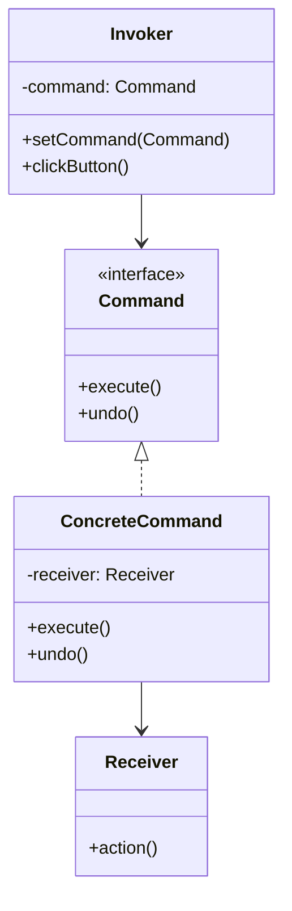

# 14. Command Pattern (Behavioral Pattern)

## Khái niệm
**Command Pattern** (Mẫu Thiết kế Lệnh) là một mẫu thiết kế hành vi giúp chuyển đổi một yêu cầu hoặc một thao tác thành một đối tượng độc lập. 

Đối tượng này chứa tất cả các thông tin cần thiết về yêu cầu đó (bao gồm phương thức cần gọi, các tham số, và đối tượng nhận lệnh). Việc chuyển đổi này cho phép bạn tham số hóa các phương thức của client, trì hoãn hoặc xếp hàng (queue) thực thi yêu cầu, và hỗ trợ các thao tác có thể hoàn tác (**Undo/Redo**).

### Ví dụ thực tế đời thường (Nhà hàng)
Để dễ hình dung, hãy tưởng tượng kịch bản bạn đi ăn tại một nhà hàng:
- **Khách hàng (Client)**: Bạn muốn gọi món.
- **Tờ Order (Command)**: Chứa thông tin món ăn cần nấu (Ví dụ: *"1 bát Phở bò"*).
- **Bồi bàn (Invoker)**: Nhận tờ Order từ bạn và chuyển vào bếp. Bồi bàn không biết nấu phở, chỉ biết chuyển tiếp tờ Order và quản lý danh sách các món cần phục vụ.
- **Đầu bếp (Receiver)**: Đọc tờ Order và thực hiện nấu. Đầu bếp mới là người có nghiệp vụ nấu ăn thực sự.

**Tại sao phải làm phức tạp như vậy?**
Nếu không có tờ Order (không dùng Command Pattern), bạn (Client) sẽ phải chạy thẳng vào bếp để yêu cầu Đầu bếp nấu phở. Khi bạn muốn hủy món (Undo), đổi món hay gọi thêm món (Queue), bạn sẽ làm loạn cả khu bếp. Có tờ Order giúp mọi thứ có tổ chức, dễ dàng hoãn, hủy hoặc lưu lại lịch sử các món đã gọi một cách khoa học.

---

## Vấn đề đặt ra
Hãy tưởng tượng bạn đang viết một trình soạn thảo văn bản. Bạn muốn thiết kế một thanh công cụ (Toolbar) có các nút bấm như Save, Copy, Paste, Cut.
Nếu bạn gắn trực tiếp logic lưu file vào nút Save, gắn logic copy vào nút Copy, hệ thống sẽ gặp các vấn đề sau:
1. **Liên kết chặt chẽ (Tight Coupling)**: Lớp Toolbar hay Button phụ thuộc trực tiếp vào các lớp nghiệp vụ (như Document, FileSystem).
2. **Trùng lặp code**: Phím tắt `Ctrl + S` cũng thực hiện chức năng lưu file giống nút Save. Nếu lập trình trực tiếp, bạn sẽ phải lặp lại logic này ở cả hai nơi.
3. **Không hỗ trợ Undo**: Rất khó để theo dõi lịch sử thao tác của người dùng để thực hiện hoàn tác khi viết code nghiệp vụ lồng chéo.

## Giải pháp của Command
Command đề xuất tách biệt giữa đối tượng gửi yêu cầu (Invoker) và đối tượng nhận/thực thi yêu cầu (Receiver).
Thay vì gửi trực tiếp, Invoker sẽ kích hoạt một **Command**. Command này triển khai một interface chung duy nhất (chứa phương thức `execute()` và tùy chọn `undo()`). 

Sự phân vai cụ thể:
- **Invoker (ví dụ: Button/RemoteControl)**: Chịu trách nhiệm kích hoạt lệnh. Nó giữ tham chiếu tới một Command nhưng không biết Command đó cụ thể làm gì hay tác động lên đối tượng nào.
- **Command Interface**: Định nghĩa interface chung (thường là `execute()`, `undo()`).
- **Concrete Command (ví dụ: SaveCommand)**: Triển khai Command Interface, liên kết giữa Receiver và hành động tương ứng.
- **Receiver (ví dụ: Document)**: Đối tượng thực sự biết cách thực hiện nghiệp vụ (như lưu văn bản, bật đèn).

---

## Cấu trúc của Command Pattern



---

## Ví dụ Minh Họa (TypeScript)

Xem mã nguồn chi tiết tại [index.ts](file:///Users/mapclient.001/Desktop/Work/Learning/BE/design-patterns/14-B-Command-pattern/index.ts).

```typescript
// 1. Receiver
class Light {
  public turnOn(): void {
    console.log("💡 Đèn đã BẬT.");
  }
  public turnOff(): void {
    console.log("💡 Đèn đã TẮT.");
  }
}

// 2. Command Interface
interface Command {
  execute(): void;
  undo(): void;
}

// 3. Concrete Command
class LightOnCommand implements Command {
  private light: Light;

  constructor(light: Light) {
    this.light = light;
  }

  public execute(): void {
    this.light.turnOn();
  }

  public undo(): void {
    this.light.turnOff();
  }
}

// 4. Invoker
class SimpleRemoteControl {
  private command!: Command;

  public setCommand(command: Command): void {
    this.command = command;
  }

  public pressButton(): void {
    this.command.execute();
  }
}
```

---

## Ưu điểm và Nhược điểm

### Ưu điểm
- **Giảm liên kết (Decoupling)**: Đối tượng kích hoạt hành động hoàn toàn độc lập với đối tượng thực hiện hành động.
- **Tính mở rộng (Open/Closed)**: Dễ dàng thêm các Command mới mà không cần chỉnh sửa code của Invoker hay Receiver.
- **Hỗ trợ Undo/Redo**: Dễ dàng theo dõi lịch sử thao tác của các lệnh để hoàn tác.
- **Tích hợp Macro Command**: Có thể gom nhóm nhiều lệnh nhỏ chạy liên tục thành một lệnh lớn.

### Nhược điểm
- **Tăng số lượng lớp**: Mỗi thao tác nhỏ cần tạo một class Command riêng biệt, dẫn đến việc phình to số lượng file code.
- **Tăng độ phức tạp khi thiết kế**.
