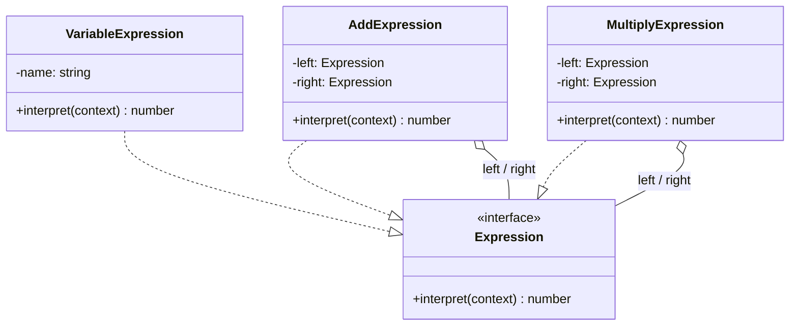

# Interpreter Pattern (Behavioral Pattern)

## Khái niệm

**Interpreter Pattern** (Mẫu Thiết kế Thông dịch) là một mẫu thiết kế hành vi định nghĩa một biểu diễn ngữ pháp cho một ngôn ngữ, cùng với một bộ thông dịch (interpreter) sử dụng biểu diễn này để thông dịch/đánh giá các câu trong ngôn ngữ đó.

---

## Ví dụ thực tế đời thường

Hãy nghĩ đến **máy tính cầm tay**. Khi bạn nhập `3 + 5 * 2`, máy tính không xử lý từ trái sang phải một cách mù quáng mà "đọc hiểu" biểu thức theo quy tắc ngữ pháp: nhân trước, cộng sau. Mỗi con số là một đơn vị cơ bản không thể tách nhỏ hơn (terminal), mỗi phép toán là một cấu trúc kết hợp chứa các biểu thức con (non-terminal). Interpreter Pattern làm chính xác điều đó: mô hình hóa ngôn ngữ thành cây và "thông dịch" từng nút theo đúng quy tắc ngữ pháp.

---

## Vấn đề đặt ra

Giả sử bạn xây dựng hệ thống lọc log cho phép admin tự định nghĩa quy tắc như: `level == "ERROR" AND service == "payment"`. Quy tắc này cần được phân tích và đánh giá trên hàng triệu dòng log mỗi ngày. Nếu hardcode từng điều kiện, mỗi khi admin muốn thêm toán tử mới (`OR`, `NOT`, `CONTAINS`), bạn phải sửa code cốt lõi và deploy lại hệ thống — vi phạm Open/Closed Principle.

Vấn đề tương tự xảy ra với bất kỳ DSL (Domain-Specific Language) đơn giản nào: bộ lọc SQL, biểu thức toán học, quy tắc cấu hình nghiệp vụ. Bạn cần một cách để "hiểu" và "thực thi" các câu lệnh trong ngôn ngữ đó một cách có cấu trúc và dễ mở rộng.

---

## Giải pháp

Interpreter Pattern mô hình hóa ngôn ngữ thành một **cây cú pháp trừu tượng (AST — Abstract Syntax Tree)**. Mỗi điều kiện đơn giản là một **TerminalExpression**. Mỗi toán tử logic (`AND`, `OR`) là một **NonTerminalExpression** chứa các biểu thức con. Để "thông dịch" một câu điều kiện, chỉ cần xây dựng cây từ câu đó rồi gọi `interpret()` từ nút gốc — đệ quy sẽ tự duyệt và tính kết quả đúng theo ngữ pháp đã định nghĩa. Thêm toán tử mới chỉ cần thêm một class Expression mới, không ảnh hưởng đến code cũ.

---

## Cấu trúc thành phần

- **Context:** Chứa thông tin toàn cục cần thiết cho việc thông dịch (ví dụ: bảng tra cứu giá trị của các biến số).
- **AbstractExpression:** Khai báo phương thức `interpret(context)` — interface chung cho tất cả nút trong cây cú pháp.
- **TerminalExpression:** Biểu thức đầu cuối (con số, biến số) — triển khai `interpret()` trực tiếp, không gọi biểu thức con nào khác.
- **NonTerminalExpression:** Biểu thức kết hợp (phép toán, toán tử logic) — triển khai `interpret()` bằng cách đệ quy gọi `interpret()` lên các biểu thức con rồi gộp kết quả.
- **Client:** Xây dựng cây AST từ câu lệnh đầu vào và kích hoạt thông dịch từ nút gốc.

---

## Sơ đồ cấu trúc



---

## Triển khai

```typescript
// 1. Abstract Expression
interface Expression {
  interpret(context: Map<string, number>): number;
}

// 2. Terminal Expression: Đại diện cho một biến số
class VariableExpression implements Expression {
  constructor(private name: string) {}

  public interpret(context: Map<string, number>): number {
    return context.get(this.name) || 0;
  }
}

// 3. Non-terminal Expression: Phép cộng
class AddExpression implements Expression {
  constructor(
    private left: Expression,
    private right: Expression
  ) {}

  public interpret(context: Map<string, number>): number {
    return this.left.interpret(context) + this.right.interpret(context);
  }
}

// 4. Non-terminal Expression: Phép nhân
class MultiplyExpression implements Expression {
  constructor(
    private left: Expression,
    private right: Expression
  ) {}

  public interpret(context: Map<string, number>): number {
    return this.left.interpret(context) * this.right.interpret(context);
  }
}

// 5. Client - Xây dựng AST cho biểu thức: x + y * 2
const context = new Map<string, number>([["x", 3], ["y", 5], ["two", 2]]);

const expression = new AddExpression(
  new VariableExpression("x"),
  new MultiplyExpression(
    new VariableExpression("y"),
    new VariableExpression("two")
  )
);

console.log(expression.interpret(context)); // 3 + (5 * 2) = 13
```

---

## Ưu điểm và Nhược điểm

### Ưu điểm
- **Dễ dàng mở rộng ngữ pháp:** Tạo thêm class Expression mới để hỗ trợ toán tử mới mà không ảnh hưởng đến các biểu thức đã có.
- **Cấu trúc đệ quy tự nhiên:** Cây AST ánh xạ trực tiếp lên ngữ pháp của ngôn ngữ, code dễ hiểu và theo dõi.

### Nhược điểm
- **Hiệu năng kém với cây lớn:** Duyệt đệ quy sâu trên cây AST lớn tiêu tốn nhiều bộ nhớ stack và CPU.
- **Bùng nổ số lượng class:** Nếu ngữ pháp có hàng trăm quy tắc, việc quản lý hàng trăm class Expression sẽ trở thành cơn ác mộng bảo trì — khi đó nên dùng thư viện phân tích cú pháp chuyên dụng như ANTLR.
