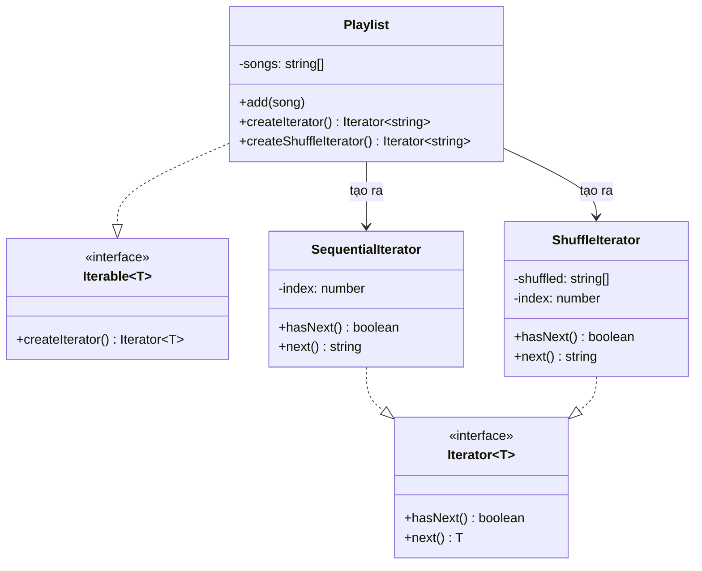

# Iterator Pattern (Behavioral Pattern)

## Khái niệm

**Iterator Pattern** (Mẫu Thiết kế Duyệt phần tử) là một mẫu thiết kế hành vi cung cấp một cách thức thống nhất để duyệt qua các phần tử của một tập hợp (collection) mà không cần phơi bày cấu trúc nội bộ của nó (danh sách, ngăn xếp, cây, đồ thị...).

Thay vì để client trực tiếp truy cập vào cấu trúc dữ liệu, pattern này tách riêng logic duyệt thành một đối tượng **Iterator** độc lập, giúp có thể có nhiều chiến lược duyệt khác nhau trên cùng một tập hợp.

---

## Ví dụ thực tế đời thường

Hãy nghĩ đến **remote điều khiển TV**. Khi bạn nhấn nút "Channel +" để chuyển kênh, bạn không cần biết danh sách kênh được lưu trong bộ nhớ TV dưới dạng mảng, linked list hay database. Remote chỉ cần hai hành động: "Còn kênh tiếp theo không?" và "Chuyển sang kênh tiếp theo." Dù nhà đài sắp xếp kênh theo thứ tự số, theo chủ đề, hay theo khu vực — remote vẫn hoạt động nhất quán. Iterator Pattern là chiếc remote điều khiển đó: cung cấp giao diện thống nhất để duyệt qua bất kỳ tập hợp nào.

---

## Vấn đề đặt ra

Hãy tưởng tượng bạn đang xây dựng tính năng **Danh sách phát nhạc (Playlist)** cho một ứng dụng nghe nhạc. Playlist có thể được duyệt theo thứ tự bình thường (từ bài đầu đến bài cuối), hoặc theo chế độ ngẫu nhiên (shuffle), hoặc thậm chí theo thứ tự đảo ngược.

Nếu trực tiếp nhúng logic duyệt vào trong chính class `Playlist`, class đó sẽ ngày càng phình to với vô số vòng lặp, index, và cờ trạng thái. Khi thêm một kiểu duyệt mới (ví dụ: lặp lại bài hiện tại), bạn phải sửa thẳng vào `Playlist`, vi phạm nguyên tắc Open/Closed.

Hơn nữa, nếu có nhiều loại tập hợp khác nhau (mảng, danh sách liên kết, cây...), client phải biết cách duyệt từng loại một cách khác nhau, khiến code client trở nên phụ thuộc chặt chẽ vào cấu trúc dữ liệu nội bộ.

---

## Giải pháp

Iterator Pattern tách logic duyệt ra khỏi tập hợp bằng cách định nghĩa một interface `Iterator` chung với các phương thức `hasNext()` và `next()`. Tập hợp chỉ cần triển khai interface `Iterable` để tạo ra đối tượng Iterator phù hợp. Client hoàn toàn không cần biết bên trong tập hợp được lưu trữ như thế nào — nó chỉ giao tiếp qua interface Iterator thống nhất.

---

## Cấu trúc thành phần

1. **Iterator Interface:** Khai báo các phương thức duyệt cần thiết, thường là `hasNext(): boolean` (còn phần tử không) và `next(): T` (lấy phần tử tiếp theo).
2. **ConcreteIterator:** Triển khai cụ thể thuật toán duyệt cho một tập hợp nhất định. Đối tượng này tự quản lý vị trí hiện tại trong quá trình duyệt.
3. **Iterable (Collection) Interface:** Khai báo một hoặc nhiều phương thức để lấy về đối tượng Iterator tương thích (ví dụ: `createIterator(): Iterator<T>`).
4. **ConcreteCollection:** Triển khai Iterable Interface, trả về một instance của ConcreteIterator tương ứng mỗi khi client yêu cầu.

---

## Sơ đồ cấu trúc



---

## Triển khai

```typescript
// 1. Iterator Interface
interface Iterator<T> {
  hasNext(): boolean;
  next(): T;
}

// 2. Iterable Interface
interface Iterable<T> {
  createIterator(): Iterator<T>;
  createShuffleIterator(): Iterator<T>;
}

// 3. ConcreteCollection
class Playlist implements Iterable<string> {
  private songs: string[] = [];

  addSong(song: string): void {
    this.songs.push(song);
  }

  createIterator(): Iterator<string> {
    return new SequentialIterator(this.songs);
  }

  createShuffleIterator(): Iterator<string> {
    return new ShuffleIterator(this.songs);
  }
}

// 4. ConcreteIterator - Duyệt tuần tự
class SequentialIterator implements Iterator<string> {
  private index = 0;

  constructor(private songs: string[]) {}

  hasNext(): boolean {
    return this.index < this.songs.length;
  }

  next(): string {
    return this.songs[this.index++];
  }
}

// 4. ConcreteIterator - Duyệt ngẫu nhiên
class ShuffleIterator implements Iterator<string> {
  private shuffled: string[];
  private index = 0;

  constructor(songs: string[]) {
    this.shuffled = [...songs].sort(() => Math.random() - 0.5);
  }

  hasNext(): boolean {
    return this.index < this.shuffled.length;
  }

  next(): string {
    return this.shuffled[this.index++];
  }
}

// 5. Client
const playlist = new Playlist();
playlist.addSong("Bohemian Rhapsody");
playlist.addSong("Hotel California");
playlist.addSong("Stairway to Heaven");

const iterator = playlist.createIterator();
while (iterator.hasNext()) {
  console.log(iterator.next());
}
```

---

## Ưu điểm và Nhược điểm

### Ưu điểm
- **Tách biệt trách nhiệm (SRP):** Logic duyệt được chuyển sang Iterator, giữ cho Collection tập trung vào việc lưu trữ dữ liệu.
- **Dễ dàng thêm kiểu duyệt mới:** Tạo thêm ConcreteIterator mới mà không cần sửa code của Collection hay client.
- **Interface thống nhất:** Client có thể duyệt mọi loại tập hợp (mảng, cây, đồ thị...) bằng cùng một interface `hasNext/next`.

### Nhược điểm
- **Quá mức cần thiết với tập hợp đơn giản:** Nếu chỉ dùng một kiểu duyệt duy nhất trên một tập hợp đơn giản, việc tạo thêm các class Iterator riêng biệt có thể là boilerplate không cần thiết.
- **Hiệu suất thấp hơn truy cập trực tiếp:** Với các thuật toán cần truy cập ngẫu nhiên theo index (random access), vòng lặp qua Iterator có thể chậm hơn so với truy cập mảng trực tiếp.
