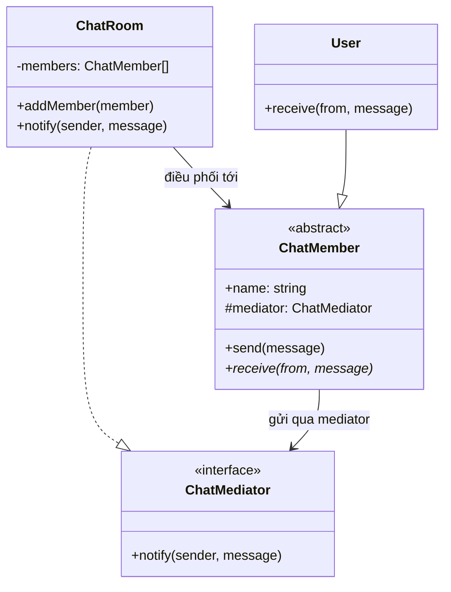

# Mediator Pattern (Behavioral Pattern)

## Khái niệm

Mediator là một mẫu thiết kế hành vi cho phép giảm sự phụ thuộc lẫn nhau giữa các đối tượng bằng cách tập trung toàn bộ giao tiếp của chúng vào một đối tượng trung gian (mediator). Các component không giao tiếp trực tiếp với nhau mà chỉ thông báo sự kiện cho mediator, mediator sẽ điều phối và quyết định ai cần được thông báo tiếp theo.

---

## Ví dụ thực tế đời thường

Hãy nghĩ đến **đài kiểm soát không lưu (ATC — Air Traffic Control)**. Các máy bay không tự liên lạc với nhau để thỏa thuận đường bay — điều đó sẽ hỗn loạn và cực kỳ nguy hiểm. Thay vào đó, mọi máy bay chỉ giao tiếp với đài kiểm soát trung tâm. Đài kiểm soát nắm toàn cảnh và điều phối tất cả: ai được hạ cánh, ai phải bay vòng chờ, ai được ưu tiên. Mỗi máy bay chỉ cần biết một địa chỉ liên lạc duy nhất — đài kiểm soát. Mediator Pattern là đài kiểm soát đó.

---

## Vấn đề đặt ra

Trong các hệ thống phức tạp, nhiều component thường cần tương tác với nhau. Ví dụ, một ứng dụng chat có nhiều thành viên — khi thành viên A gửi tin nhắn, thành viên B, C, D đều phải nhận được. Nếu mỗi thành viên tự giữ danh sách tham chiếu đến tất cả thành viên khác và gọi trực tiếp, hệ thống trở thành một mạng lưới phụ thuộc chằng chịt. Khi số lượng component tăng lên, độ phức tạp tăng theo hàm mũ — thêm hoặc xóa một thành viên đòi hỏi phải sửa code ở rất nhiều nơi.

Vấn đề tương tự xảy ra trong một form phức tạp: khi người dùng chọn quốc gia thì danh sách thành phố phải cập nhật, khi checkbox được tích thì nút Submit mới được bật. Nếu mỗi thành phần tự theo dõi trạng thái của nhau, code sẽ cực kỳ rối rắm và khó bảo trì.

Vấn đề cốt lõi là **tight coupling** (liên kết chặt chẽ): mỗi component biết quá nhiều về cấu trúc nội bộ của các component khác, làm cho việc tái sử dụng từng component riêng lẻ gần như không thể.

---

## Giải pháp

Mediator Pattern đề xuất loại bỏ hoàn toàn sự giao tiếp trực tiếp giữa các component. Thay vào đó, tất cả giao tiếp đều đi qua một đối tượng trung gian duy nhất — Mediator. Mỗi component chỉ cần biết đến Mediator và thông báo sự kiện của mình thông qua một phương thức duy nhất (thường là `notify`). Mediator nắm toàn bộ logic điều phối: nhận sự kiện từ component này và kích hoạt hành động phù hợp trên các component khác. Điều này biến mạng lưới phụ thuộc nhiều chiều thành mô hình ngôi sao (star topology) đơn giản và dễ quản lý.

---

## Cấu trúc thành phần

1. **Mediator Interface:** Định nghĩa phương thức giao tiếp mà các component sẽ dùng để thông báo sự kiện, thường là `notify(sender: Component, event: string)`.
2. **ConcreteMediator:** Triển khai logic điều phối cụ thể — biết tất cả các component, nhận sự kiện từ một component và quyết định phản ứng nào cần kích hoạt trên các component khác.
3. **Component (Base Class):** Lớp cơ sở cho các đối tượng tham gia, giữ một tham chiếu đến mediator và dùng nó để giao tiếp thay vì gọi trực tiếp lẫn nhau.
4. **ConcreteComponent:** Các thành phần cụ thể (thành viên chat, máy bay, dropdown, checkbox...) — chỉ gọi `mediator.notify()` khi có sự kiện xảy ra, không biết gì về các component khác.

---

## Sơ đồ cấu trúc



---

## Triển khai

```typescript
// 1. Mediator Interface
interface ChatMediator {
  notify(sender: ChatMember, message: string): void;
}

// 2. Base Component
abstract class ChatMember {
  constructor(
    public name: string,
    protected mediator: ChatMediator
  ) {}

  public send(message: string): void {
    this.mediator.notify(this, message);
  }

  public abstract receive(from: string, message: string): void;
}

// 3. ConcreteMediator
class ChatRoom implements ChatMediator {
  private members: ChatMember[] = [];

  public addMember(member: ChatMember): void {
    this.members.push(member);
  }

  public notify(sender: ChatMember, message: string): void {
    for (const member of this.members) {
      if (member !== sender) {
        member.receive(sender.name, message);
      }
    }
  }
}

// 4. ConcreteComponent
class User extends ChatMember {
  public receive(from: string, message: string): void {
    console.log(`[${this.name}] nhận tin từ ${from}: "${message}"`);
  }
}

// 5. Client
const room = new ChatRoom();
const alice = new User("Alice", room);
const bob = new User("Bob", room);
const charlie = new User("Charlie", room);

room.addMember(alice);
room.addMember(bob);
room.addMember(charlie);

alice.send("Chào mọi người!"); // Bob và Charlie đều nhận được
```

---

## Ưu điểm và Nhược điểm

### Ưu điểm
- **Giảm coupling:** Các component hoàn toàn độc lập với nhau, chỉ phụ thuộc vào mediator interface — dễ tái sử dụng và kiểm thử từng component riêng lẻ.
- **Single Responsibility:** Logic điều phối được tập trung một chỗ (ConcreteMediator), thay vì phân tán khắp nơi trong các component.
- **Dễ mở rộng:** Thêm component mới chỉ cần đăng ký với mediator, không cần sửa code của các component đã có.

### Nhược điểm
- **Mediator trở thành God Object:** Nếu hệ thống có quá nhiều component và tương tác phức tạp, ConcreteMediator có thể phình to và khó bảo trì.
- **Tập trung hóa có thể thành điểm nghẽn:** Toàn bộ logic điều phối nằm trong một class, gây khó khăn khi cần debug hoặc hiểu luồng tương tác phức tạp.
- **Tăng độ phức tạp gián tiếp:** Với hệ thống đơn giản, thêm một lớp mediator có thể là over-engineering không cần thiết.
