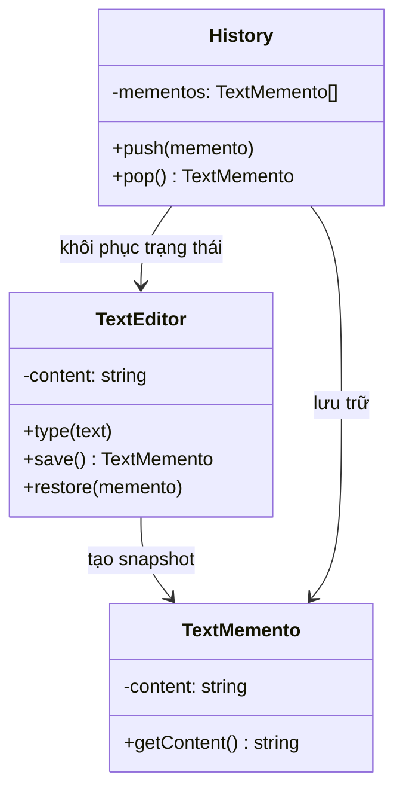

# Memento Pattern (Behavioral Pattern)

## Khái niệm

Memento là một mẫu thiết kế hành vi cho phép lưu và khôi phục trạng thái nội tâm (internal state) của một đối tượng mà không vi phạm nguyên tắc đóng gói (encapsulation). Đối tượng tạo ra một "bản chụp" (snapshot) trạng thái của mình — gọi là Memento — và giao cho bên ngoài lưu giữ, nhưng bên ngoài không được phép đọc hay chỉnh sửa nội dung bên trong Memento đó.

---

## Ví dụ thực tế đời thường

Hãy nghĩ đến **tính năng Ctrl+Z (Undo) trong Microsoft Word**. Mỗi khi bạn gõ một đoạn văn, Word lặng lẽ lưu lại một "bản chụp" trạng thái tài liệu lúc đó vào lịch sử. Bạn không thể — và không cần — trực tiếp chỉnh sửa lịch sử đó. Khi bạn nhấn Ctrl+Z, Word lấy bản chụp gần nhất ra và phục hồi tài liệu về trạng thái trước. Đó chính xác là cách Memento Pattern hoạt động: Originator (tài liệu) tự tạo snapshot, Caretaker (lịch sử undo) lưu giữ mà không cần hiểu nội dung bên trong.

---

## Vấn đề đặt ra

Hầu hết ứng dụng cần tính năng Undo/Redo — người dùng gõ nhầm text, thay đổi cài đặt sai, hay nhân vật trong game mất máu vì bước vào khu vực nguy hiểm đều muốn quay về trạng thái trước đó. Giải pháp trực quan là lưu toàn bộ trạng thái của đối tượng ra bên ngoài. Tuy nhiên, điều này vi phạm encapsulation: đối tượng phải lộ hết các thuộc tính private ra bên ngoài để code quản lý lịch sử có thể đọc và sao chép.

Vấn đề trở nên nghiêm trọng hơn khi trạng thái nội tâm của đối tượng phức tạp — nhiều thuộc tính có kiểu dữ liệu khác nhau, một số có thể là tham chiếu lồng nhau. Nếu code bên ngoài trực tiếp thao tác với những thuộc tính này, mọi thay đổi trong cấu trúc nội bộ của đối tượng đều phải được cập nhật đồng bộ ở code quản lý lịch sử — tạo ra sự liên kết chặt chẽ rất dễ gây lỗi.

---

## Giải pháp

Memento Pattern trao trách nhiệm tạo snapshot hoàn toàn cho chính đối tượng cần lưu trạng thái (Originator). Originator tạo ra một đối tượng Memento chứa bản sao trạng thái nội tâm của nó và trả về cho bên ngoài lưu giữ — nhưng Memento là "hộp đen" đối với bên ngoài. Đối tượng quản lý lịch sử (Caretaker) chỉ được phép lưu trữ và trả lại các Memento, không được đọc hay sửa nội dung bên trong. Khi cần khôi phục, Caretaker trả Memento về cho Originator, và chỉ Originator mới biết cách đọc dữ liệu từ Memento để phục hồi trạng thái.

---

## Cấu trúc thành phần

1. **Originator:** Đối tượng có state cần được lưu. Nó tạo Memento bằng phương thức `save()` và khôi phục trạng thái từ Memento bằng phương thức `restore(memento)`.
2. **Memento:** Đối tượng snapshot lưu trữ trạng thái nội tâm của Originator tại một thời điểm. Nên là immutable — chỉ được tạo một lần, không được sửa sau đó. Bên ngoài (Caretaker) không được truy cập vào nội dung.
3. **Caretaker:** Đối tượng quản lý lịch sử các Memento — thường dùng stack (LIFO) để hỗ trợ undo. Caretaker không biết và không cần biết gì về nội dung bên trong Memento.

---

## Sơ đồ cấu trúc



---

## Triển khai

```typescript
// 1. Memento — snapshot bất biến của trạng thái
class TextMemento {
  constructor(private readonly content: string) {}

  public getContent(): string {
    return this.content;
  }
}

// 2. Originator — đối tượng có state cần lưu
class TextEditor {
  private content: string = "";

  public type(text: string): void {
    this.content += text;
  }

  public save(): TextMemento {
    return new TextMemento(this.content);
  }

  public restore(memento: TextMemento): void {
    this.content = memento.getContent();
  }

  public getContent(): string {
    return this.content;
  }
}

// 3. Caretaker — quản lý lịch sử, không truy cập nội dung memento
class UndoManager {
  private history: TextMemento[] = [];

  public push(memento: TextMemento): void {
    this.history.push(memento);
  }

  public pop(): TextMemento | undefined {
    return this.history.pop();
  }
}

// 4. Client
const editor = new TextEditor();
const undoManager = new UndoManager();

editor.type("Hello");
undoManager.push(editor.save()); // Lưu snapshot

editor.type(", World");
undoManager.push(editor.save()); // Lưu snapshot

editor.type("!!!");
console.log(editor.getContent()); // "Hello, World!!!"

const previous = undoManager.pop();
if (previous) editor.restore(previous);
console.log(editor.getContent()); // "Hello, World"
```

---

## Ưu điểm và Nhược điểm

### Ưu điểm
- **Không vi phạm encapsulation:** Originator tự tạo và tự đọc Memento — trạng thái nội tâm không bao giờ bị lộ ra ngoài.
- **Đơn giản hóa Originator:** Originator không cần duy trì lịch sử trạng thái của chính mình, đó là việc của Caretaker.
- **Undo/Redo dễ dàng:** Chỉ cần lưu Memento trước mỗi thay đổi, thao tác undo trở thành việc pop từ stack và gọi restore.

### Nhược điểm
- **Tốn bộ nhớ:** Mỗi Memento là một bản sao đầy đủ của trạng thái. Với object có state lớn và nhiều thao tác, lịch sử có thể tiêu tốn rất nhiều bộ nhớ.
- **Caretaker không thể dọn dẹp thông minh:** Vì không biết nội dung bên trong Memento, Caretaker không thể tối ưu hóa (ví dụ: bỏ qua snapshot trùng lặp) mà không phá vỡ encapsulation.
- **Chi phí deep-copy phức tạp:** Với Originator có state là object lồng nhau sâu, việc tạo snapshot đúng cách đòi hỏi xử lý cẩn thận để tránh reference leak.
