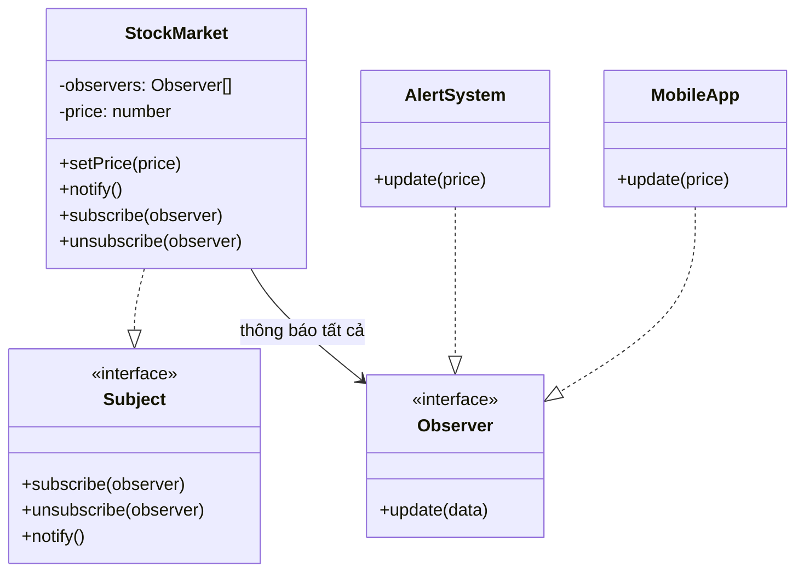

# Observer Pattern (Behavioral Pattern)

## Khái niệm

**Observer** (hay còn gọi là Publish-Subscribe) là một mẫu thiết kế hành vi cho phép bạn định nghĩa một cơ chế đăng ký thông báo (subscription) giữa nhiều object.

Khi **Subject** (đối tượng được quan sát) thay đổi trạng thái, tất cả các **Observer** (đối tượng quan sát) đã đăng ký đều được thông báo và tự động cập nhật.

---

## Ví dụ thực tế đời thường

Hãy nghĩ đến **kênh YouTube**. Khi một YouTuber đăng video mới, họ không cần biết ai đang xem kênh của mình hay gọi điện từng người. Người xem chủ động nhấn "Đăng ký" để nhận thông báo — và khi có video mới, YouTube tự động gửi thông báo đến toàn bộ subscriber. Người xem có thể hủy đăng ký bất cứ lúc nào. Đây chính là Observer Pattern: kênh YouTube là Subject, mỗi subscriber là một Observer, nút chuông là cơ chế `subscribe/unsubscribe`.

---

## Vấn đề đặt ra

Hãy tưởng tượng bạn đang xây dựng một ứng dụng theo dõi giá cổ phiếu thời gian thực. Hệ thống có nhiều màn hình hiển thị khác nhau: mobile app, dashboard web, hệ thống cảnh báo email. Tất cả đều cần biết ngay khi giá cổ phiếu thay đổi.

Nếu bạn để từng màn hình liên tục gọi API để polling giá cổ phiếu (phương thức "kéo" - pull), bạn sẽ tốn tài nguyên khổng lồ, phản hồi chậm trễ, và code mỗi component phải tự quản lý vòng lặp polling riêng — rất khó bảo trì.

Nếu bạn để `StockMarket` chủ động gọi thẳng vào các màn hình cụ thể để thông báo, `StockMarket` sẽ phải biết rõ về từng loại màn hình, bị phụ thuộc chặt chẽ vào chúng. Mỗi khi thêm màn hình mới, bạn phải sửa code `StockMarket` — vi phạm nguyên lý Open/Closed.

---

## Giải pháp

Mẫu Observer khuyên bạn thêm vào Subject một cơ chế đăng ký (subscription): Subject chỉ lưu danh sách Observer dưới dạng interface chung, không biết chúng là ai cụ thể. Khi trạng thái thay đổi, Subject duyệt danh sách và gọi method `update()` trên từng Observer. Mỗi Observer tự quyết định xử lý thông báo đó như thế nào.

---

## Cấu trúc thành phần

1. **Subject Interface:** Khai báo các method quản lý Observer: `subscribe(observer)`, `unsubscribe(observer)`, `notify()`.
2. **ConcreteSubject:** Lưu trạng thái nội tại và danh sách Observer. Khi trạng thái thay đổi, gọi `notify()` để thông báo toàn bộ danh sách.
3. **Observer Interface:** Khai báo method `update(data)` mà Subject sẽ gọi khi có thông báo.
4. **ConcreteObserver:** Triển khai cụ thể method `update()`, định nghĩa hành động thực hiện khi nhận thông báo.

---

## Sơ đồ cấu trúc



---

## Triển khai

```typescript
// 1. Observer Interface
interface Observer {
  update(data: number): void;
}

// 2. Subject Interface
interface Subject {
  subscribe(observer: Observer): void;
  unsubscribe(observer: Observer): void;
  notify(): void;
}

// 3. ConcreteSubject
class StockMarket implements Subject {
  private observers: Observer[] = [];
  private price: number = 0;

  public subscribe(observer: Observer): void {
    this.observers.push(observer);
  }

  public unsubscribe(observer: Observer): void {
    this.observers = this.observers.filter((o) => o !== observer);
  }

  public setPrice(price: number): void {
    this.price = price;
    this.notify();
  }

  public notify(): void {
    for (const observer of this.observers) {
      observer.update(this.price);
    }
  }
}

// 4. ConcreteObserver
class MobileApp implements Observer {
  public update(price: number): void {
    console.log(`[Mobile] Giá mới: $${price}`);
  }
}

class AlertSystem implements Observer {
  public update(price: number): void {
    if (price < 100) {
      console.log(`[Alert] CẢNH BÁO: Giá giảm xuống $${price}!`);
    }
  }
}

// 5. Client
const market = new StockMarket();
const mobile = new MobileApp();
const alert = new AlertSystem();

market.subscribe(mobile);
market.subscribe(alert);

market.setPrice(150); // [Mobile] Giá mới: $150
market.setPrice(90);  // [Mobile] Giá mới: $90 + [Alert] CẢNH BÁO...

market.unsubscribe(mobile);
market.setPrice(80);  // Chỉ [Alert] nhận thông báo
```

---

## Ưu điểm và Nhược điểm

### Ưu điểm
- **Loose Coupling (Giảm phụ thuộc):** Subject không cần biết Observer là ai cụ thể, chỉ cần biết chúng implement Observer interface.
- **Tuân thủ Open/Closed Principle:** Thêm Observer mới không cần sửa Subject, chỉ cần tạo class mới và đăng ký.
- **Cơ chế broadcast linh hoạt:** Một sự kiện thay đổi trên Subject tự động lan truyền đến tất cả Observer đã đăng ký.

### Nhược điểm
- **Thứ tự thông báo không đảm bảo:** Observer được thông báo theo thứ tự trong danh sách, có thể gây ra hành vi không mong muốn nếu các Observer phụ thuộc lẫn nhau.
- **Memory leak tiềm ẩn:** Nếu Observer không `unsubscribe` đúng lúc, Subject sẽ giữ tham chiếu đến chúng mãi, ngăn garbage collector thu hồi bộ nhớ.
- **Cascade bất ngờ:** Một Observer có thể kích hoạt thay đổi trên Subject trong lúc xử lý `update()`, dẫn đến chuỗi thông báo vòng lặp khó debug.
