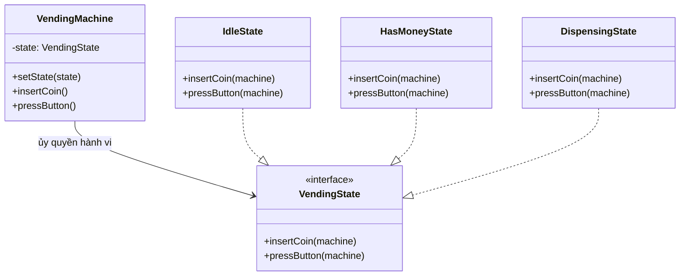

# State Pattern (Behavioral Pattern)

## Khái niệm

**State** là một mẫu thiết kế hành vi cho phép một object thay đổi hành vi của mình khi trạng thái nội tâm thay đổi.

Từ bên ngoài, object trông như thể đã thay đổi class — cùng một method được gọi trên object nhưng cho ra kết quả hoàn toàn khác nhau tùy thuộc vào trạng thái hiện tại.

---

## Ví dụ thực tế đời thường

Hãy nghĩ đến **công tắc giật dây của quạt trần**. Bạn chỉ thực hiện duy nhất một hành động là **giật dây** (`pull()`), nhưng hành vi của quạt lại hoàn toàn khác nhau tùy thuộc vào số (trạng thái) hiện tại:
- Nếu đang **Tắt** → Giật dây sẽ chuyển sang **Quay chậm**.
- Nếu đang **Quay chậm** → Giật dây sẽ chuyển sang **Quay trung bình**.
- Nếu đang **Quay trung bình** → Giật dây sẽ chuyển sang **Quay nhanh**.
- Nếu đang **Quay nhanh** → Giật dây sẽ **Tắt quạt**.

Bản thân chiếc quạt tự quản lý trạng thái số hiện tại của nó. Mỗi trạng thái (Tắt, Chậm, Trung bình, Nhanh) tự định nghĩa hành vi quay tương ứng và biết khi nào cần chuyển sang trạng thái tiếp theo sau cú giật dây.

---

## Vấn đề đặt ra

Hãy tưởng tượng bạn xây dựng một máy bán hàng tự động (Vending Machine). Máy có nhiều trạng thái: đang chờ (Idle), đã nhận tiền (HasMoney), đang phát hàng (Dispensing), hết hàng (OutOfStock). Mỗi hành động của người dùng (bỏ tiền vào, nhấn chọn hàng, lấy hàng) cho kết quả khác nhau tùy từng trạng thái.

Nếu bạn cài đặt tất cả logic bằng `if/else` hoặc `switch-case` bên trong máy, phương thức `insertCoin()` hay `pressButton()` sẽ trở nên khổng lồ và cực kỳ rối rắm. Mỗi khi thêm trạng thái mới (ví dụ: "đang bảo trì"), bạn phải lục tung tất cả các `if/else` trên toàn bộ class để sửa — vi phạm nghiêm trọng nguyên lý Open/Closed.

Hơn nữa, các điều kiện lồng nhau trong từng hành động rất dễ sai logic: trạng thái A có thể vô tình xử lý theo logic của trạng thái B khi code phức tạp, gây ra lỗi khó tìm.

---

## Giải pháp

Mẫu State khuyên bạn tạo ra các class riêng biệt cho từng trạng thái và đặt tất cả hành vi liên quan vào trong đó. **Context** (đối tượng chính) chỉ lưu tham chiếu đến **State** hiện tại và ủy quyền (delegate) tất cả hành vi xuống State đó. Khi cần chuyển trạng thái, State tự gọi `context.setState(newState)` để cập nhật. Thêm trạng thái mới chỉ cần thêm một class State mới, không sửa code cũ.

---

## Cấu trúc thành phần

1. **State Interface:** Khai báo tất cả các method ứng với các hành động của Context. Mỗi method tương ứng một hành động có thể thực hiện trong hệ thống.
2. **ConcreteState:** Triển khai cụ thể từng trạng thái. Mỗi ConcreteState xử lý hành động theo logic riêng của trạng thái đó. Có thể tự chuyển trạng thái của Context bằng cách gọi `context.setState(newState)`.
3. **Context:** Lưu tham chiếu đến State hiện tại và cung cấp setter để State có thể thay đổi trạng thái. Mọi hành động từ bên ngoài đều được ủy quyền xuống State hiện tại.

---

## Sơ đồ cấu trúc



---

## Triển khai

```typescript
// 1. State Interface
interface VendingState {
  insertCoin(machine: VendingMachine): void;
  pressButton(machine: VendingMachine): void;
}

// 2. Context
class VendingMachine {
  private state: VendingState;

  constructor(initialState: VendingState) {
    this.state = initialState;
  }

  public setState(state: VendingState): void {
    this.state = state;
  }

  public insertCoin(): void {
    this.state.insertCoin(this);
  }

  public pressButton(): void {
    this.state.pressButton(this);
  }
}

// 3. ConcreteState - Trạng thái chờ
class IdleState implements VendingState {
  public insertCoin(machine: VendingMachine): void {
    console.log("Đã nhận đồng xu. Vui lòng chọn hàng.");
    machine.setState(new HasMoneyState());
  }

  public pressButton(machine: VendingMachine): void {
    console.log("Vui lòng bỏ tiền trước.");
  }
}

// 4. ConcreteState - Đã có tiền
class HasMoneyState implements VendingState {
  public insertCoin(machine: VendingMachine): void {
    console.log("Đã có tiền rồi. Vui lòng chọn hàng.");
  }

  public pressButton(machine: VendingMachine): void {
    console.log("Đang phát hàng...");
    machine.setState(new IdleState());
  }
}

// 5. Client
const machine = new VendingMachine(new IdleState());

machine.pressButton(); // "Vui lòng bỏ tiền trước."
machine.insertCoin();  // "Đã nhận đồng xu. Vui lòng chọn hàng."
machine.pressButton(); // "Đang phát hàng..."
machine.pressButton(); // "Vui lòng bỏ tiền trước." — quay về Idle
```

---

## Ưu điểm và Nhược điểm

### Ưu điểm
- **Loại bỏ điều kiện phức tạp:** Thay thế các khối `if/else` hoặc `switch-case` lớn bằng các class riêng biệt, code sạch và dễ đọc hơn nhiều.
- **Tuân thủ Single Responsibility & Open/Closed Principle:** Mỗi State class chỉ chịu trách nhiệm một trạng thái cụ thể. Thêm trạng thái mới chỉ cần thêm class mới, không phá vỡ code cũ.
- **Chuyển trạng thái rõ ràng và có kiểm soát:** Logic chuyển trạng thái nằm ngay trong State class, dễ dàng xác định từ trạng thái nào có thể chuyển sang trạng thái nào.

### Nhược điểm
- **Số lượng class tăng nhanh:** Mỗi trạng thái là một class riêng. Hệ thống có nhiều trạng thái sẽ tạo ra nhiều class nhỏ, làm tăng sự phức tạp tổng thể của project.
- **Overhead với hệ thống ít trạng thái:** Nếu chỉ có 2-3 trạng thái đơn giản, áp dụng State Pattern có thể là over-engineering so với dùng một vài `if/else` đơn giản.
