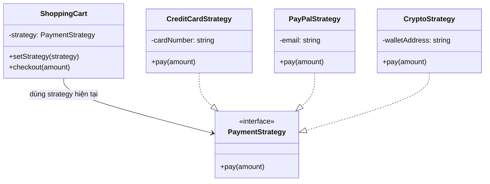

# Strategy Pattern (Behavioral Pattern)

## Khái niệm

**Strategy** là một mẫu thiết kế hành vi định nghĩa một họ các thuật toán, đóng gói từng thuật toán riêng biệt thành các lớp độc lập, và làm cho chúng có thể hoán đổi cho nhau trong runtime.

Strategy cho phép thuật toán thay đổi độc lập với các Client sử dụng nó — Client chỉ biết đến một interface chung, không quan tâm đến cách triển khai cụ thể bên trong.

---

## Ví dụ thực tế đời thường

Hãy nghĩ đến việc **lựa chọn phương tiện đi từ nhà đến công ty**. Bạn có thể đi xe máy (nhanh, linh hoạt), xe buýt (rẻ, đông người), hay taxi (thoải mái, đắt hơn). Mục tiêu cuối cùng đều là "đến nơi" — nhưng chiến lược di chuyển khác nhau hoàn toàn. Mỗi sáng bạn có thể chọn chiến lược khác nhau tùy thời tiết, giờ giấc, tâm trạng — mà không cần thay đổi "bạn" hay "điểm đến". Strategy Pattern là cách đóng gói từng "chiến lược di chuyển" đó thành các lựa chọn có thể hoán đổi linh hoạt.

---

## Vấn đề đặt ra

Hãy tưởng tượng bạn đang xây dựng một ứng dụng e-commerce với chức năng thanh toán. Ban đầu chỉ hỗ trợ thanh toán bằng thẻ tín dụng, nhưng theo thời gian cần bổ sung PayPal, ví tiền điện tử (Crypto), chuyển khoản ngân hàng...

Nếu bạn viết toàn bộ logic thanh toán vào một lớp `ShoppingCart` với hàng loạt câu lệnh `if/else` hoặc `switch/case`, mỗi lần thêm phương thức thanh toán mới lại phải sửa trực tiếp vào lớp đó. Đây là vi phạm nghiêm trọng nguyên lý **Open/Closed Principle** — mở để mở rộng nhưng đóng để sửa đổi.

Hơn nữa, lớp `ShoppingCart` ngày càng phình to và chứa quá nhiều trách nhiệm không liên quan đến nhau. Việc kiểm thử (unit test) từng phương thức thanh toán riêng lẻ cũng trở nên cực kỳ khó khăn vì chúng bị gắn chặt vào một lớp duy nhất.

---

## Giải pháp

Strategy Pattern tách biệt từng thuật toán (ở đây là từng phương thức thanh toán) ra thành các lớp riêng biệt, đều implement cùng một **Strategy Interface**. Lớp Context (`ShoppingCart`) chỉ giữ một tham chiếu đến interface đó và gọi thông qua interface — không biết cụ thể strategy nào đang chạy.

Khi cần thay đổi hành vi, Client chỉ cần gọi `setStrategy()` để hoán đổi sang strategy mới mà không cần động chạm đến Context. Thêm phương thức thanh toán mới chỉ đơn giản là tạo thêm một lớp implement interface — không sửa code cũ.

---

## Cấu trúc thành phần

1. **Strategy Interface:** Khai báo phương thức chung mà tất cả các concrete strategy phải implement. Context chỉ giao tiếp với strategy thông qua interface này.
2. **Concrete Strategy A, B, C...:** Các lớp triển khai cụ thể của Strategy Interface, mỗi lớp chứa một biến thể khác nhau của cùng một thuật toán.
3. **Context:** Lớp duy trì một tham chiếu đến một Strategy object. Nó có phương thức `setStrategy()` để thay đổi strategy trong runtime và một phương thức để thực thi strategy hiện tại.
4. **Client:** Tạo ra các strategy object cụ thể và truyền vào Context. Client quyết định strategy nào sẽ được dùng tại từng thời điểm.

---

## Sơ đồ cấu trúc



---

## Triển khai

```typescript
// 1. Strategy Interface
interface PaymentStrategy {
  pay(amount: number): void;
}

// 2. Concrete Strategies
class CreditCardStrategy implements PaymentStrategy {
  constructor(private cardNumber: string) {}

  pay(amount: number): void {
    console.log(`Thanh toán $${amount} bằng thẻ tín dụng ${this.cardNumber}`);
  }
}

class PayPalStrategy implements PaymentStrategy {
  constructor(private email: string) {}

  pay(amount: number): void {
    console.log(`Thanh toán $${amount} qua PayPal (${this.email})`);
  }
}

class CryptoStrategy implements PaymentStrategy {
  constructor(private walletAddress: string) {}

  pay(amount: number): void {
    console.log(`Thanh toán $${amount} bằng Crypto, ví: ${this.walletAddress}`);
  }
}

// 3. Context
class ShoppingCart {
  private strategy: PaymentStrategy;

  constructor(strategy: PaymentStrategy) {
    this.strategy = strategy;
  }

  setStrategy(strategy: PaymentStrategy): void {
    this.strategy = strategy;
  }

  checkout(amount: number): void {
    this.strategy.pay(amount);
  }
}

// 4. Client
const cart = new ShoppingCart(new CreditCardStrategy("1234-5678-9012-3456"));
cart.checkout(150);

// Hoán đổi strategy trong runtime — không sửa ShoppingCart
cart.setStrategy(new PayPalStrategy("user@example.com"));
cart.checkout(200);

cart.setStrategy(new CryptoStrategy("0xABCD...1234"));
cart.checkout(300);
```

---

## Ưu điểm và Nhược điểm

### Ưu điểm
- **Tuân thủ Open/Closed Principle:** Thêm thuật toán mới chỉ cần tạo class mới implement interface, không cần sửa code Context hiện có.
- **Hoán đổi thuật toán trong runtime:** Context có thể linh hoạt thay đổi behavior ngay khi chương trình đang chạy thông qua `setStrategy()`.
- **Tách biệt trách nhiệm:** Mỗi thuật toán nằm trong lớp riêng, dễ test độc lập, dễ đọc và bảo trì.

### Nhược điểm
- **Tăng số lượng lớp:** Mỗi thuật toán là một lớp riêng, với nhiều biến thể có thể dẫn đến sự bùng nổ số lượng class trong codebase.
- **Client phải hiểu sự khác biệt:** Client cần biết các strategy khác nhau như thế nào để chọn đúng strategy phù hợp với ngữ cảnh, điều này làm lộ ra một phần logic nội bộ.
- **Overhead không cần thiết:** Nếu chỉ có vài biến thể và hiếm khi thay đổi, việc áp dụng Strategy Pattern có thể là over-engineering so với một câu lệnh `if/else` đơn giản.
