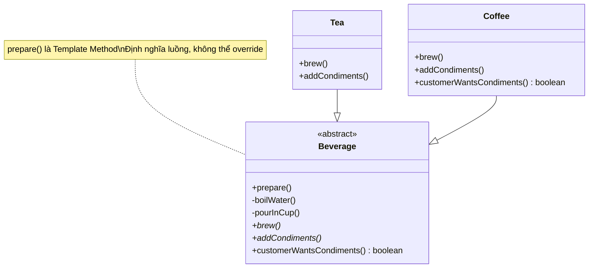

# Template Method Pattern (Behavioral Pattern)

## Khái niệm

**Template Method** là một mẫu thiết kế hành vi định nghĩa bộ khung (skeleton) của một thuật toán trong lớp cha (abstract class), đồng thời cho phép các lớp con override một số bước cụ thể mà không làm thay đổi cấu trúc tổng thể của thuật toán.

Nói cách khác, lớp cha nắm quyền kiểm soát "luồng chạy" (what steps and what order), còn lớp con chỉ được phép tùy chỉnh "nội dung từng bước" (how each step works).

---

## Ví dụ thực tế đời thường

Hãy nghĩ đến **quy trình tuyển dụng nhân viên** tại một công ty. Mọi vị trí đều trải qua các bước giống nhau: nộp hồ sơ → phỏng vấn HR → phỏng vấn chuyên môn → offer letter → onboarding. Tuy nhiên, bước "phỏng vấn chuyên môn" lại khác nhau hoàn toàn tùy vị trí: kỹ sư phần mềm làm bài test code, nhân viên thiết kế trình bày portfolio, sales thì role-play tình huống bán hàng. Bộ phận HR giữ nguyên khung quy trình, còn từng bộ phận chuyên môn tự định nghĩa nội dung bước của mình. Đó chính là Template Method.

---

## Vấn đề đặt ra

Hãy tưởng tượng bạn đang xây dựng một ứng dụng pha đồ uống. Cả trà và cà phê đều có quy trình pha tương tự nhau: đun sôi nước, pha thức uống, rót vào ly, thêm phụ gia. Nếu bạn copy-paste quy trình này vào từng lớp `Tea` và `Coffee`, bạn sẽ vi phạm nguyên lý **DRY (Don't Repeat Yourself)** ngay lập tức.

Khi cần thay đổi một bước trong quy trình chung (ví dụ: thêm bước kiểm tra nhiệt độ nước), bạn phải sửa ở nhiều nơi cùng lúc — dễ quên, dễ sinh ra lỗi không nhất quán. Codebase trở nên khó bảo trì và không thể mở rộng một cách an toàn.

Vấn đề trở nên tồi tệ hơn khi có thêm nhiều loại đồ uống: sinh tố, trà sữa, cacao... Tất cả đều chia sẻ cùng khung quy trình nhưng lại có các bước chi tiết khác nhau. Việc quản lý logic trùng lặp phân tán khắp nơi là một cơn ác mộng cho bảo trì.

---

## Giải pháp

Template Method Pattern đề xuất đặt bộ khung thuật toán vào một **phương thức template** trong lớp cha trừu tượng. Phương thức này gọi các bước con theo đúng thứ tự, nhưng một số bước được khai báo là `abstract` — buộc lớp con phải triển khai cụ thể.

Ngoài ra còn có các **hook methods** — phương thức có implementation mặc định (thường là rỗng hoặc trả về `true`), lớp con có thể override hoặc không tùy ý. Đây là điểm mở rộng linh hoạt mà không bắt buộc.

---

## Cấu trúc thành phần

1. **Abstract Class:** Chứa `templateMethod()` định nghĩa bộ khung thuật toán bằng cách gọi các bước theo thứ tự. Cũng khai báo các abstract methods và hook methods.
2. **Abstract Methods:** Các bước bắt buộc mà lớp con phải triển khai, vì lớp cha không có cách nào biết chi tiết cụ thể.
3. **Hook Methods:** Các bước tùy chọn có implementation mặc định. Lớp con có thể override nếu cần tùy biến thêm.
4. **Concrete Classes:** Các lớp kế thừa từ Abstract Class, override các abstract methods và hook methods theo nhu cầu cụ thể của mình.

---

## Sơ đồ cấu trúc



---

## Triển khai

```typescript
// 1. Abstract Class với Template Method
abstract class Beverage {
  // Template Method — định nghĩa bộ khung, không nên override
  prepare(): void {
    this.boilWater();
    this.brew();
    this.pourInCup();
    if (this.customerWantsCondiments()) {
      this.addCondiments();
    }
  }

  // Bước dùng chung — không cần override
  private boilWater(): void {
    console.log("Đun sôi nước...");
  }

  private pourInCup(): void {
    console.log("Rót vào ly...");
  }

  // 2. Abstract Methods — lớp con bắt buộc phải triển khai
  protected abstract brew(): void;
  protected abstract addCondiments(): void;

  // 3. Hook Method — lớp con có thể override hoặc không
  protected customerWantsCondiments(): boolean {
    return true;
  }
}

// 4. Concrete Class Tea
class Tea extends Beverage {
  protected brew(): void {
    console.log("Ngâm túi trà...");
  }

  protected addCondiments(): void {
    console.log("Thêm chanh và mật ong...");
  }
}

// 4. Concrete Class Coffee — override hook để bỏ phụ gia
class Coffee extends Beverage {
  protected brew(): void {
    console.log("Pha cà phê qua máy...");
  }

  protected addCondiments(): void {
    console.log("Thêm sữa và đường...");
  }

  protected customerWantsCondiments(): boolean {
    return false; // Khách uống đen, không cần phụ gia
  }
}

// 5. Client
console.log("=== Pha Trà ===");
new Tea().prepare();
// Đun sôi nước... → Ngâm túi trà... → Rót vào ly... → Thêm chanh và mật ong...

console.log("\n=== Pha Cà phê ===");
new Coffee().prepare();
// Đun sôi nước... → Pha cà phê qua máy... → Rót vào ly...
```

---

## Ưu điểm và Nhược điểm

### Ưu điểm
- **Loại bỏ code trùng lặp:** Bộ khung thuật toán chỉ được định nghĩa một lần ở lớp cha, các bước chung được tái sử dụng hoàn toàn.
- **Kiểm soát điểm mở rộng:** Lớp cha kiểm soát chặt chẽ "cái gì có thể thay đổi" thông qua abstract methods và hooks, ngăn lớp con phá vỡ luồng tổng thể.
- **Tuân thủ Hollywood Principle:** "Đừng gọi chúng tôi, chúng tôi sẽ gọi bạn" — lớp cha gọi các phương thức của lớp con, không phải ngược lại.

### Nhược điểm
- **Bị ràng buộc bởi kế thừa:** Template Method dựa vào inheritance, làm cho cấu trúc cứng nhắc hơn so với composition. Lớp con bị phụ thuộc vào implementation của lớp cha.
- **Khó theo dõi luồng thực thi:** Khi có nhiều lớp con với nhiều override khác nhau, việc debug và lần theo luồng chạy thực tế có thể gây nhầm lẫn.
- **Vi phạm Liskov Substitution Principle tiềm ẩn:** Lớp con override sai một hook method có thể phá vỡ hành vi kỳ vọng của toàn bộ thuật toán một cách ngầm định.
