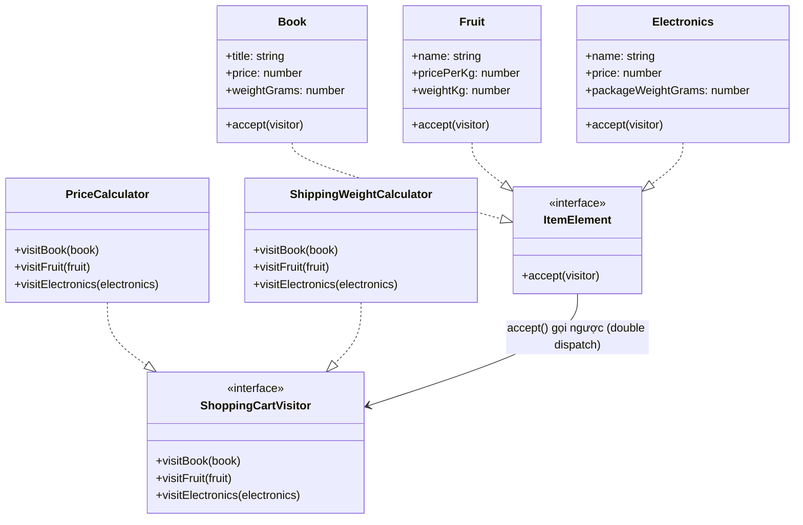

# Visitor Pattern (Behavioral Pattern)

## Khái niệm

Visitor là một Behavioral Pattern cho phép **thêm các thao tác mới lên một cấu trúc đối tượng mà không cần sửa đổi các lớp của đối tượng đó**. Pattern tách biệt thuật toán (visitor) ra khỏi các đối tượng mà thuật toán tác động lên (element), giúp mở rộng hành vi theo nguyên tắc Open/Closed.

---

## Ví dụ thực tế đời thường

Hãy nghĩ đến **đoàn kiểm tra thuế**. Một đoàn thanh tra đến thành phố và lần lượt ghé thăm từng cơ sở kinh doanh: nhà hàng, khách sạn, cửa hàng bán lẻ. Mỗi cơ sở không thay đổi cách họ vận hành — họ chỉ "chấp nhận" (accept) đoàn thanh tra vào và cung cấp thông tin. Chính đoàn thanh tra mang theo nghiệp vụ tính thuế riêng cho từng loại hình kinh doanh. Ngày mai có thể có đoàn kiểm tra phòng cháy chữa cháy với nghiệp vụ hoàn toàn khác, nhưng các cơ sở kinh doanh vẫn không cần thay đổi gì. Visitor Pattern hoạt động y hệt như vậy.

---

## Vấn đề đặt ra

Giả sử bạn xây dựng một ứng dụng giỏ hàng (Shopping Cart) với nhiều loại mặt hàng: `Book` (Sách), `Fruit` (Trái cây), `Electronics` (Đồ điện tử). Ban đầu, bạn chỉ cần tính giá tiền cho từng mặt hàng, nên bạn viết method `calculatePrice()` trực tiếp vào từng class.

Mọi thứ hoạt động tốt cho đến khi hệ thống mở rộng và phát sinh các nhu cầu mới: tính tổng khối lượng vận chuyển (`calculateWeight()`), in nhãn hóa đơn (`generateLabel()`), hay tính điểm thưởng tích lũy (`calculateRewardPoints()`).

Nếu cứ mỗi lần có tính năng mới, bạn lại đi sửa tất cả các class sản phẩm để thêm các method tương ứng, bạn sẽ vi phạm nghiêm trọng nguyên lý **Open/Closed**. Các class sản phẩm sẽ ngày càng phình to và chứa các logic nghiệp vụ không liên quan đến bản chất thực sự của chúng (ví dụ: một cuốn sách `Book` không nên chứa logic tính toán phí vận chuyển).

---

## Giải pháp

Visitor tách biệt hoàn toàn "thao tác cần thực hiện" khỏi "đối tượng bị tác động". Mỗi class sản phẩm chỉ cần implement một method `accept(visitor)` duy nhất — method này gọi ngược lại `visitor.visitX(this)` (kỹ thuật **double dispatch**). Khi cần thêm tính năng mới (tính tiền, tính cân nặng, tính điểm thưởng...), bạn chỉ cần tạo một class `ConcreteVisitor` mới mà không cần chạm vào bất kỳ class sản phẩm nào.

---

## Cấu trúc thành phần

1. **Visitor (interface):** Khai báo một tập hợp các method `visitXxx(element)` — mỗi method tương ứng với một loại ConcreteElement cụ thể.
2. **ConcreteVisitor:** Implement toàn bộ các visit method theo logic riêng của mình (ví dụ: `PriceCalculator`, `ShippingWeightCalculator`). Mỗi Visitor đóng gói một thuật toán hoàn chỉnh.
3. **Element (interface):** Khai báo method `accept(visitor: Visitor): void` để các ConcreteElement bắt buộc phải implement.
4. **ConcreteElement:** Implement `accept()` bằng cách gọi đúng method visit tương ứng trên visitor — `visitor.visitConcreteElementX(this)`. Đây là bước thực hiện double dispatch.
5. **Client:** Duyệt qua cấu trúc đối tượng và gọi `accept(visitor)` trên từng element, truyền vào visitor mong muốn.

---

## Sơ đồ cấu trúc



---

## Triển khai

```typescript
// 1. Visitor interface
interface ShoppingCartVisitor {
  visitBook(book: Book): number;
  visitFruit(fruit: Fruit): number;
  visitElectronics(electronics: Electronics): number;
}

// 2. Element interface
interface ItemElement {
  accept(visitor: ShoppingCartVisitor): number;
}

// 3. Concrete Elements — Chỉ lưu trữ thông tin, không tự cài đặt logic nghiệp vụ
class Book implements ItemElement {
  constructor(
    public readonly title: string,
    public readonly price: number,
    public readonly weightGrams: number
  ) {}

  accept(visitor: ShoppingCartVisitor): number {
    return visitor.visitBook(this); // double dispatch
  }
}

class Fruit implements ItemElement {
  constructor(
    public readonly name: string,
    public readonly pricePerKg: number,
    public readonly weightKg: number
  ) {}

  accept(visitor: ShoppingCartVisitor): number {
    return visitor.visitFruit(this);
  }
}

class Electronics implements ItemElement {
  constructor(
    public readonly name: string,
    public readonly price: number,
    public readonly packageWeightGrams: number
  ) {}

  accept(visitor: ShoppingCartVisitor): number {
    return visitor.visitElectronics(this);
  }
}

// 4. Concrete Visitors — Thêm thuật toán tính toán mà không sửa các class sản phẩm
class PriceCalculator implements ShoppingCartVisitor {
  visitBook(book: Book): number {
    return book.price * 0.9; // Sách được giảm giá 10%
  }

  visitFruit(fruit: Fruit): number {
    return fruit.pricePerKg * fruit.weightKg; // Tính tiền theo cân nặng
  }

  visitElectronics(electronics: Electronics): number {
    return electronics.price * 1.1; // Đồ điện tử thêm 10% VAT
  }
}

class ShippingWeightCalculator implements ShoppingCartVisitor {
  visitBook(book: Book): number {
    return book.weightGrams;
  }

  visitFruit(fruit: Fruit): number {
    return fruit.weightKg * 1000; // Đổi kg sang gram
  }

  visitElectronics(electronics: Electronics): number {
    return electronics.packageWeightGrams;
  }
}

// 5. Client
const cart: ItemElement[] = [
  new Book("Clean Code", 150000, 450),
  new Fruit("Táo Envy", 80000, 1.5),
  new Electronics("Bàn phím cơ", 1200000, 800),
];

// Thực hiện tính tiền
const priceCalculator = new PriceCalculator();
let totalAmount = 0;
cart.forEach(item => {
  totalAmount += item.accept(priceCalculator);
});
console.log(`Tổng tiền giỏ hàng: ${totalAmount}đ`);

// Thực hiện tính cân nặng
const weightCalculator = new ShippingWeightCalculator();
let totalWeight = 0;
cart.forEach(item => {
  totalWeight += item.accept(weightCalculator);
});
console.log(`Tổng cân nặng giỏ hàng: ${totalWeight}g`);
```

---

## Ưu điểm và Nhược điểm

### Ưu điểm
- **Open/Closed Principle:** Thêm tính năng mới bằng cách tạo Visitor mới, không cần sửa các class Element hiện có.
- **Single Responsibility Principle:** Mỗi Visitor đóng gói một thuật toán hoàn chỉnh, tách biệt khỏi dữ liệu mà nó xử lý.
- **Tích lũy trạng thái dễ dàng:** Visitor có thể tích lũy thông tin qua nhiều element trong một lần duyệt (ví dụ: đếm tổng số từ trên toàn tài liệu).

### Nhược điểm
- **Vi phạm Encapsulation:** Để Visitor có thể thực hiện công việc, các ConcreteElement thường phải expose các trường dữ liệu nội bộ (public hoặc getter), làm yếu đi tính đóng gói.
- **Khó mở rộng Element:** Khi thêm một ConcreteElement mới, bạn phải cập nhật toàn bộ tất cả các Visitor hiện có — đây là sự đánh đổi trực tiếp với việc dễ thêm Visitor.
- **Phức tạp hơn cần thiết:** Với hệ thống ít loại Element và ít thao tác biến đổi, Visitor gây ra overhead về cấu trúc không đáng có.
